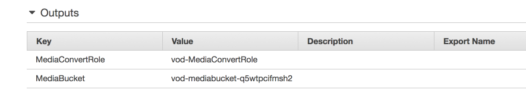

# AWS IAM and S3 User Module

This module guides the participant in setting up the AWS resources needed to complete the Video on Demand workshop. You will create and configure an AWS S3 bucket to store outputs from MediaConvert. You will also create a role that allows MediaConvert access to the resources in your account that are needed to convert videos. 

You can optionally create a restricted user with access only to the resources needed to complete the lab.

## Prerequisites

### Region

MediaConvert is available in several regions. But for the purpose of this lab, we will use the **US West (Oregon)** region.

## Preconfigured AWS Account 

If you are completing this lab as part of an in-person workshop, your account has been preconfigured with the permissions, roles and buckets needed for the workshop.  You will need to locate the name of the resources to be used in future steps in the Outputs for the CloudFormation stack that did the account setup.  

1. Open the CloudFormation console for the region you are working in (us-west-2).  
1. From the Stacks page, find the Stack called **vod** or **vod-dayofweek**. 
1. Go to the Stack details page and expand the Outputs section.  You will find two outputs there:
    * **MediaConvertRole** is the name of the AWS Role that can be passed to MediaConvert to grant access to S3 and other account resources MediaConvert needs to process jobs.
    * **MediaBucket** is the name of the bucket you will use to store MediaConvert outputs.

    
1. **Save this page in a browser tab** to use in future steps of the Workshop.


Move forward to the next module  [**AWS Elemental Media Convert Jobs**](../2-MediaConvertJobs/README.md).

## No previous account configuration 

Do this step only if you are not using a preconfigured account. 

In order to complete this workshop you'll need an AWS Account with access to create policies and roles within the AWS Identity and Access Management (IAM) service. 

The signed-in user must have the AdministratorAccess policy or a policy that allows the user to access all actions for the mediaconvert service and at least read access to CloudWatch. The steps for creating a policy for AWS Elemental MediaPConvert is covered near the end of this module.

The code and instructions in this workshop assume only one student is using a given AWS account at a time. If you try sharing an account with another student, you'll run into naming conflicts for certain resources. You can work around this by either using a suffix in your resource names or using distinct Regions, but the instructions do not provide details on the changes required to make this work.

### Skip ahead with CloudFormation

If you would like to skip this part of the lab and move on the the next module, you can run the CloudFormation provided with this project.

1. Make sure your region is set to US-West-Oregon for this lab.
1. From the AWS Management Console, click on **Services** and then select **CloudFormation**.
1. Select **Create stack** to go to the **Create stack** page
1. Select the **Upload a template to Amazon S3** checkbox then select **Choose file**
1. Navigate to the directory where you downloaded the lab.  Then select **1-IAMandS3->MediaConvertIAMandS3.yaml**. Then select **Open**.
1. Select **Next** to move to the **Specify details** page.
1. Enter `vod` for the in the **Stack name** box.  Note: you can choose other stack names, but using "vod" will create resource with names consistent with the rest of the lab.
1. Select **Next** to move to the **Options** page.  Leave this page as defaults.
1. Select **Next** to move to the **Review** page.
1. Select the checkbox to acknowledge creating resources, then select **Create**
1. Wait for the stack to be created.
1. From the Stacks page, find the Stack called **vod**.
1. Go to the Stack details page and expand the Outputs section of the page.  You will find two outputs there:
    
    * **MediaConvertRole** is the ARN for the AWS Role that can be passed to MediaConvert to grant access to S3 and other account resources MediaConvert needs to process jobs.
1. Save this page in a browser tab or save the ARNs to be used in future steps of the Workshop.

Move forward to the next module  [**AWS Elemental Media Convert Jobs**](../2-MediaConvertJobs/README.md).

### Create a IAM Role to Use with AWS Elemental MediaConvert

MediaConvert will will need to be granted permissions to read and write files from your S3 buckets and generate CloudWatch events as it processes videos.  MediaConvert is granted the permissions it needs by assuming a role that is passed to it when you create a job.

#### High-Level Instructions

Use the IAM console to create a new role. Name it `vod-MediaConvertRole` and select AWS MediaConvert.

#### Detailed Instructions

1. From the AWS Management Console, click on **Services** and then select **IAM** in the Security, Identity & Compliance section.

1. Select **Roles** in the left navigation bar and then choose **Create new role**.

1. Select **AWS Service** and **Lambda** for the role type, then click on the **Next:Permissions** button.

    **Note:** Selecting a role type automatically creates a trust policy for your role that allows AWS services to assume this role on your behalf. If you were creating this role using the CLI, AWS CloudFormation or another mechanism, you would specify a trust policy directly.

    **Note:** MediaConvert is a new service and isn't listed in IAM at this time.  We will select Lambda as the role type and then modify the trust policy to add the MediaConvert service. **FIXME**

1. Choose **Next:Review**.

1. Enter `vod-MediaConvertRole` for the **Role name**.

1. Choose **Create role**.


1. Type `vod-MediaConvertRole` into the filter box on the Roles page and choose the role you just created.

1. On the Trust relationships tab, click on the **Edit trust relationship** button

1. Replace the trust relationship with the following JSON:

```
{
  "Version": "2012-10-17",
  "Statement": [
    {
      "Effect": "Allow",
      "Principal": {
        "Service": [
            "mediaconvert.ap-northeast-1.amazonaws.com",
            "mediaconvert.ap-southeast-1.amazonaws.com",
            "mediaconvert.ap-southeast-2.amazonaws.com",
            "mediaconvert.eu-central-1.amazonaws.com",
            "mediaconvert.eu-west-1.amazonaws.com",
            "mediaconvert.us-east-1.amazonaws.com",
            "mediaconvert.us-west-1.amazonaws.com",
            "mediaconvert.us-west-2.amazonaws.com"
        ]
      },
      "Action": "sts:AssumeRole"
    }
  ]
}
```

1. Click on **Update Trust policy** to save the policy

1. On the Permissions tab, click on the **Inline Policies** section and choose the **click here** link to create a new inline policy.

   

1. Click on the **Custom Policy** radio button and then click on **Select**
1. On the Review Policy page, enter `vod-MediaConvertPolicy` in the policy name box.

1. Copy and paste the following JSON into the **Policy Document** box:

```
{
    "Statement": [
        {
            "Action": [
                "s3:*"
            ],
            "Resource": [
                "*"
            ],
            "Effect": "Allow"
        },
        {
            "Action": [
                "autoscaling:Describe*",
                "cloudwatch:*",
                "logs:*",
                "sns:*"
            ],
            "Resource": [
                "*"
            ],
            "Effect": "Allow"
        }
    ]
}
```

1. Click on **Apply Policy** to add the policy.
1. Scroll to the top of the page for your new policy and note the **ARN**. You will use this in the following modules.

## 2. Create an S3 bucket to store and host MediaConvert outputs

### No previous account configuration

In this section, you will use the AWS console to create an S3 bucket to store video and image outputs from MediaConvert and host a simple web page that can be used to play out the videos.  Later, the resulting videos and images will be played out using the S3 https resource using several different players both inside and outside of the the amazonaws domain.  

In order to facilitate https access from anonymous sources inside and outside the amazonaws domain, such as video players on the internet, you will add the following settings to the S3 bucket:

* a bucket policy that enables public read   
* a policy for Cross Origin Resource Sharing (CORS) 

#### Detailed instructions 

1. In the AWS Management Console choose **Services** then select **S3** under Storage.

1. Choose **+Create Bucket**.

1. Provide a globally unique name for your bucket such as `vod-lastname`.

1. Select the Region you've chosen to use for this workshop from the dropdown.

1. Choose **Create** in the lower left of the dialog without selecting a bucket to copy settings from.

    

1. From the S3 console select the bucket you just created and go to the Overview page.
1. Select the **Properties** tab and click on the **Static website hosting** tile.  
1. Select the **Use this bucketto host a website** box.
1. Enter `index.html` in the **Index document** box.
1. Select **Save**.
1. Select the **Permissions** tab.
1. Select **Bucket policy** and paste the following JSON into the bucket policy editor.
1. Replace the text **YOUR-BUCKETNAME** with the name of the bucket you created earlier in this module.

    ```
    {
    "Version": "2012-10-17",
    "Statement": [
        {
            "Sid": "AddPerm",
            "Effect": "Allow",
            "Principal": "*",
            "Action": "s3:GetObject",
            "Resource": "arn:aws:s3:::YOUR-BUCKETNAME/*"
        }
    ]
    }
    ```
1. Click on **Save**
1. Next, click on **CORS configruation** and enter the following XML into the **CORS configuration editor**.
    ```
    <?xml version="1.0" encoding="UTF-8"?>
    <CORSConfiguration xmlns="http://s3.amazonaws.com/doc/2006-03-01/">
    <CORSRule>
        <AllowedOrigin>*</AllowedOrigin>
        <AllowedMethod>GET</AllowedMethod>
        <MaxAgeSeconds>3000</MaxAgeSeconds>
        <AllowedHeader>*</AllowedHeader>
    </CORSRule>
    </CORSConfiguration>
    ```

1. Select **Save**

### (Optional) Adding AWS Elemental MediaConvert permissions to an IAM user

This section goes over policies you will need to add if you are creating restricted IAM user accounts that can run MediaConvert.  This will give the IAM user access to all MediaConvert service APIs and console. 

#### High-Level Instructions

You may want to create restricted users to work with MediaConvert.  This section goes through creating the policy needed to complete this lab for a user that doesn't have Administrator access.  This step needs to be completed by a user with Administrator access to grant permissions.

Create an IAM Policy and name it `vod-MediaConvertUserPolicy`.  Use inline policies to grant permissions to other resources needed for the execute MediaConvert.  Attach the new policy to an IAM user.

#### Detailed Instructions - create a managed policy
1. From the AWS Management Console, click on **Services** and then select **IAM** in the Security, Identity & Compliance section.
1. Select **Policies** from the side bar menu.
1. Click on the **Create policy** button.
1. Select **Create Your Own Policy**.
1. Enter `vod-MediaConvertUserPolicy` as the policy name
1. Copy and paste the following JSON into the **Policy Document**, then select **Create** to create the policy
```
{
    "Version": "2012-10-17",
    "Statement": [
        {
            "Sid": "AccessMediaConvert",
            "Effect": "Allow",
            "Action": [
                "mediaconvert:*"
            ],
            "Resource": [
                "arn:aws:mediaconvert:*"
            ]
        },
        {
            "Sid": "PassRolestoMediaConvert",
            "Action": [
                "iam:ListRoles",
                "iam:PassRole"
            ],
            "Effect": "Allow",
            "Resource": "arn:aws:iam::*"
        },
        {
            "Sid": "ListWriteS3Buckets",
            "Action": "s3:*",
            "Effect": "Allow",
            "Resource": "*"
        }
    ]
}
```

#### Detailed Instructions - attach the managed policy to an IAM user

1. Select **Users** from the IAM side bar menu.
1. Click on the User Name you want to add permissions to navigate to the user Summary page.
1. Select **Add permissions** 
1. On the Grant Permissions page, select **Attach existing policies directly**
1. Enter `vod-MediaConvertUserPolicy` in the search box and then select the checkbox for the policy from the returned results. 
1. Select the **Next: Review** button on the bottom of the page.
1. Select the **Add permission** button

6. Click on Validate Policy to check for typos, then click Apply Policy

## Completion

At the end of the module you have created a IAM Role to allow access from MediaConvert to resources in your account. You have also (optionally ) added MediaConvert permissions to a user.

Move forward to the next module  [**AWS Elemental Media Convert Jobs**](../2-MediaConvertJobs/README.md).
