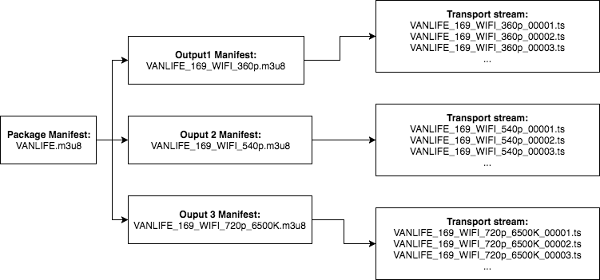
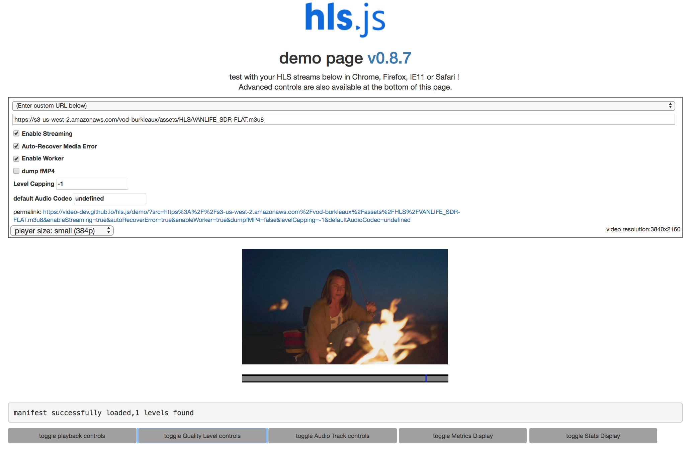
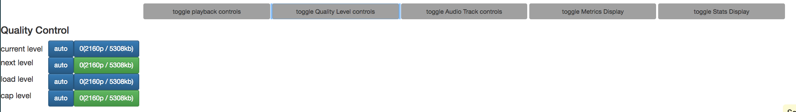
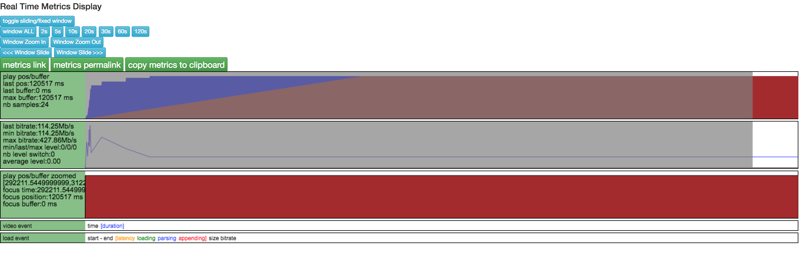

# Video players 

If you completed the Live Streaming Workshop, then this content will be somewhat familiar since it overlaps in the discussion of tools for playing HLS video from https endpoints.  In addition to HLS players, we will go a little deeper into observing the components of the video packages produced by MediaConvert including more details about how adaptive bitrate works and use the hls.js demo page to observe how a player plays out our HLS video. 

## Prerequisites

### Previous Modules

This module relies on the configuration of IAM and S3 done in modules 1 and 2.

You need the following resources created in modules 1 and 2: 
* **MediaConvert outputs from module 2 in S3** - you will be playing out the HLS video created from module 2.

### Video Players for Testing

We will use web-based players that can play out videos from https endpoints to test our videos. These players are useful for demonstrating playout of various video features including adaptive bitrate streaming, captioning, and multi-language audio. In all cases, you provide the endpoint URL from S3 to the player.  

1. https://video-dev.github.io/hls.js/demo/
2. http://videojs.github.io/videojs-contrib-hls/
3. https://developer.jwplayer.com/tools/stream-tester/

## Test the HLS output from MediaConvert 

HLS stands for HTTP Live Streaming. It is an _adaptive bitrate_ format used for delivering video over the internet.  Video is stored as equal _segments_ in multiple files, with the extensions .ts, that make up a _transport stream_.  Each transport stream has a _manifest_ file, with the extension .m3u8, that tells the player how to play out files in the transport stream.  Each video can also have multiple transport streams of the same video encoded at different bitrates.  Since HLS is an adaptive bitrate protocol, the player can select the best quality bitrate based on the network bandwith available at a given time.  The player can also switch between bitrates at segment boundaries to adjust to changes in network badwidth. Finally, each group of transport streams has a _package manifest_  file with a .m3u8 extension that stores information about all of the available transport stream for the video.

The image below shows the hierarchy of files that MediaConvert produces for the HLS output group for the VANLIFE video.

### View HLS video quality levels and metrics from a player

1. Navigate to the AWS S3 Summary page for the ouput bucket you used in your MediaConvert job.
1. Open the **assets/HLS** folder.  
2. Locate the package manifest file **VANLIFE.m3u8** and click on the object name to open the Overview page for the object.
1. Copy the link from the bottom of the page.  
1. Open the hls.js demo page and paste the link into the hls.js player and play the video: https://video-dev.github.io/hls.js/demo/ 

    

3. Select the **toggle Quality Levels controls** to show the different quality levels in the adaptive bitrate stack.  You should see the three levels corresponding to the three MediaConvert outputs in the Apple HLS output group.

    

1. You can select the different quality levels to contol which output to play in the player.
4. Next, select the **toggle Metrics controls** to show a chart of the bitrate and quality level selection chosen by the player over time. 

    

## Completion

At the end of the module you learned how to test streaming video endpoints using web players. You learned about the design of browser pages that support video playback, how different security models of browsers effect streaming playback, and how to access live and restart window streams of the origin service using URL parameters. 
