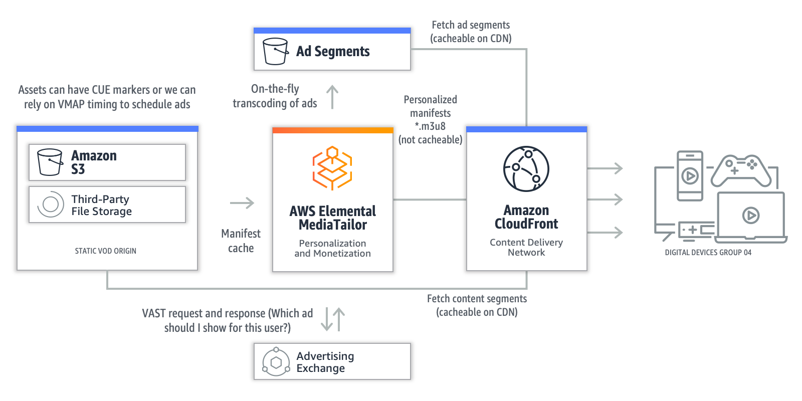
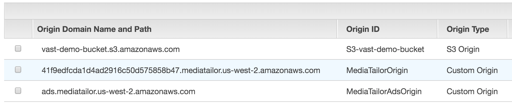
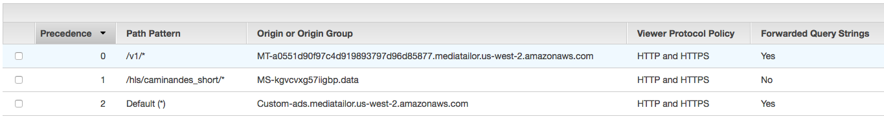
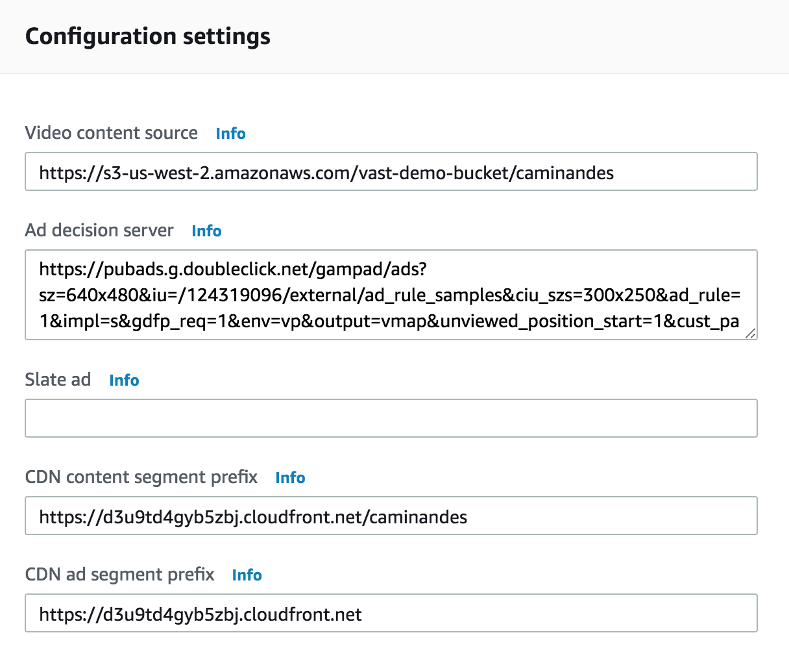

# VOD Ad insertion with AWS Elemental MediaTailor

After you have transcoded video assets into HLS with AWS Elemental MediaConvert, one thing you might want to do is monetize your content. The AWS Elemental MediaTailor service helps you achieve just that. You may learn more about the service [here](https://aws.amazon.com/mediatailor/).

This workshop will take you through creating an AWS Elemental MediaTailor configuration using a media asset from a storage like AWS Elemental MediaStore, and Ad Decision Server (ADS) that returns a VMAP response. VMAP is one of the ad serving protocols that AWS Elemental MediaTailor supports and lends itself well to VOD workflows. The VMAP protocol defines the ad breaks and their timings, and can be used with assets with no ad markers, which is what we will be using here. Once the basic MediaTailor configuration has been completed and verified, this workshop will also walk you through integrating the configuration with CloudFront for distribution.

Below is a diagram showing how the media asset interacts with AWS Elemental MediaTailor.
	

## Prerequisites
This lab assumes that you have the following:
1. An HLS media asset either in Amazon S3, AWS Elemental MediaStore, or some other file storage. The asset need not have any ad markers. In this tutorial, we will use [this asset](https://s3-us-west-2.amazonaws.com/vast-demo-bucket/caminandes/master.m3u8) stored in S3.
1. An Ad Decision Server (ADS), or you may use a static VAST response XML hosted on a server. Here, we will use a sample VMAP response hosted and publicly made available by Google's DoubleClick for Publishers and can be found [here](https://pubads.g.doubleclick.net/gampad/ads?sz=640x480&iu=/124319096/external/ad_rule_samples&ciu_szs=300x250&ad_rule=1&impl=s&gdfp_req=1&env=vp&output=vmap&unviewed_position_start=1&cust_params=deployment%3Ddevsite%26sample_ar%3Dpremidpost&cmsid=496&vid=short_onecue&correlator=).

## Implementation Instructions

### 1. Create an AWS Elemental MediaTailor Configuration 

**Step-by-step instructions**

1. From the AWS Management Console, choose **Services** then select **AWS Elemental MediaTailor**. 

1. Click on **Create configuration**.

1. Enter `MyTestCampaign` for the **Configuration  Name**.

1. For the **Video content source**, enter the S3 URL link to the asset Endpoint URL `https://s3-us-west-2.amazonaws.com/vast-demo-bucket/caminandes/master.m3u8` but  **_without the manifest filename_**. That is, **omit** master.m3u8.

1. Enter `https://pubads.g.doubleclick.net/gampad/ads?sz=640x480&iu=/124319096/external/ad_rule_samples&ciu_szs=300x250&ad_rule=1&impl=s&gdfp_req=1&env=vp&output=vmap&unviewed_position_start=1&cust_params=deployment%3Ddevsite%26sample_ar%3Dpremidpost&cmsid=496&vid=short_onecue&correlator=[avail.random]` for the **Ad decision server**. 

	

1. Click **Create Configuration**. Click on the **Configurations** link to see the configuration you just created. Click on **MyTestCampaign** to see the **Playback endpoints** populated with playback URLs. Note down the **HLS playback prefix** as you'll need it in the next section.

### 2. Test MediaTailor Playback 

1. To verify that ads are making it into your video, you may use a standalone video player to view the HLS playback endpoint such as QuickTime, VLC or any workstation-based player that supports HLS. Alternatively, you may use one of the following web-based players to stream your video: 

	* http://videojs.github.io/videojs-contrib-hls/
	* https://developer.jwplayer.com/tools/stream-tester/

1. Your full playback URL will be the **HLS playback prefix** (eg. _https://f445cfa805184f3e8d86dc2ac1137efa.mediatailor.us-west-2.amazonaws.com/v1/master/cf6421621b389b384c1fd22e51603ee95db76ae0/MyTestCampaign/_)
concatenated with the **manifest filename of the asset in MediaStore** (eg. _master.m3u8_) 

	Provide the full playback URL to the player of your choice (eg.   _https://f445cfa805184f3e8d86dc2ac1137efa.mediatailor.us-west-2.amazonaws.com/v1/master/cf6421621b389b384c1fd22e51603ee95db76ae0/MyTestCampaign/master.m3u8_)

1. With the VMAP response used here, you should see a 10-second preroll ad right at the beginning. Then, 15 seconds into the video, you should see a 10-second midroll ad. And finally, a 10-second postroll ad at the end. Note that it can take a few minutes for the ads to get transcoded and then properly stitched into the HLS manifest generated by AWS Elemental MediaTailor. This means that you may not see all the ads right away when you first play the asset back.

### 3. Integrate with Amazon CloudFront

**Step-by-step instructions**

#### 3a. Add Origins to Your Distribution 

1. From the AWS Management Console, choose **Services** then select **CloudFront**.

1. Click on **Create Distribution**. 

1. Select the **Web** delivery method for your content and hit the **Get Started** button. 

1. Under **Origin Settings**, enter the domain name of your origin for **Origin Domain Name**. In our case, this is the domain name of our S3 bucket (eg. _vast-demo-bucket.s3.amazonaws.com_).

1. Under **Origin Protocol Policy**, select **HTTPS only**. 

1. Take the default for all the other settings. But scroll down until you see the **Comment** textbox and enter `CloudFront for MediaTailor`.

1. Click the **Create Distribution** button. This will take you back to the main Distribution page of cloudfront. Your distribution will be in an **In Progress** state. The quickest way to tell which of the Distributions is yours is by the comment you entered. 

1. Go back to the **Origins and Origin Group** tab, and click on the **Create Origin** button. 

1. Enter MediaTailor's hostname for the **Origin Domain Name**. This will come from the **HLS playback prefix** of MediaTailor (e.g. _f445cfa805184f3e8d86dc2ac1137efa.mediatailor.us-west-2.amazonaws.com_)

1. Update the **Origin Protocol Policy** to **HTTPS Only**. Click **Create**. 

1. Go back to the **Origins** tab, and click on the **Create Origin** button. 

1. Enter MediaTailor's ad server hostname for the **Origin Domain Name**. If MediaTailor is being set up in us-west-2 then the Origin is:
`ads.mediatailor.us-west-2.amazonaws.com`

1. Update the **Origin Protocol Policy** to **HTTPS Only**.  Click on **Create**.

	

#### 3b. Add Cache Behaviors to Your Distribution

1. Click on the **Behaviors** tab and click on the **Create Behavior** button.

1. Enter `/caminandes/*` for the **Path Pattern**. 

1. Under **Origin**, select the S3 origin. 

1. Click the **Create** button to add another cache behavior. 

1. Click on **Create Behavior** button. 

1. Enter `/v1/*` for the **Path Pattern**. 

1. Under **Origin**, select the MediaTailor origin. 

1. For **Query String Forwarding and Caching**, select **Forward all, cache based on all**. 

1. Click the **Create** button to add another cache behavior. 

1. Select the **Default** behavior, and click on the **Edit** button.

1. Make sure the **Origin** is pointed to the Ad Server origin (e.g. _ads.mediatailor.us-west-2.amazonaws.com_)

1. For **Query String Forwarding and Caching**, select **Forward all, cache based on all**. 

1. Click on **Yes, Edit** button. 

1. Double-check the precedence of the caching behavior as this matters. Your primary precedence should be the MediaTailor origin (precedence 0), followed by the S3 origin (precedence 1), and lastly by the ads origin (which is at Precedence 2 and is the Default). If this is not the precedence reflected, select one of the Behaviors and **Change Precedence** by clicking on either the **Move Up** or **Move Down** button, to make the adjustment. 

	

## Update MediaTailor Configuration with CloudFront Details

1. From the AWS Management Console, choose **Services** then select **AWS Elemental MediaTailor**.

1. Click on the Configuration (`MyTestCampaign`) you created in section 1 and hit the **Edit** button.

1. For the **CDN content segment prefix**, construct your URL by putting together the protocol, the CloudFront **Domain Name**, and the path of the MediaStore origin. For example: _https://**da4bw8c4fh0km.cloudfront.net**/caminandes_

1. For the **CDN ad segment prefix**, construct your URL by putting together the protocol, and the CloudFront  **Domain Name**. For example: _https://da4bw8c4fh0km.cloudfront.net_

	

## Test MediaTailor Playback with CloudFront

1. Once your CloudFront distribution is in the **Deployed** status, and **Enabled** state, try playing back your stream using the same player you selected in section 2 of this lab. Take your playback URL from Section 2, Step 2 and replace the MediaTailor hostname with the CloudFront **Domain Name** that was assigned to your distribution. 

	For example, if your MediaTailor playback URL is:

	_https://**f445cfa805184f3e8d86dc2ac1137efa.mediatailor.us-west-2.amazonaws.com**/v1/master/cf6421621b389b384c1fd22e51603ee95db76ae0/MyTestCampaign/master.m3u8_

	then your CloudFront playback URL is:
	_https://**da4bw8c4fh0km.cloudfront.net**/v1/master/cf6421621b389b384c1fd22e51603ee95db76ae0/MyTestCampaign/master.m3u8_)

## Completion
Congratulations! You've successfully integrated your HLS video asset with AWS Elemental MediaTailor.

Return to the [main](../README.md) page.

## Cloud Resource Clean Up

### AWS Elemental MediaTailor
Select the configuration you created and hit the **Delete** button to clean up your resources.

### Amazon CloudFront
Select the distribution that you created and hit the **Disable** button. Once the distribution's **State** reflects Disabled, select the same distribution and hit the **Delete** button. 
