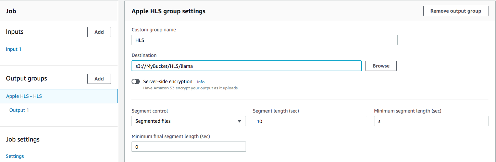
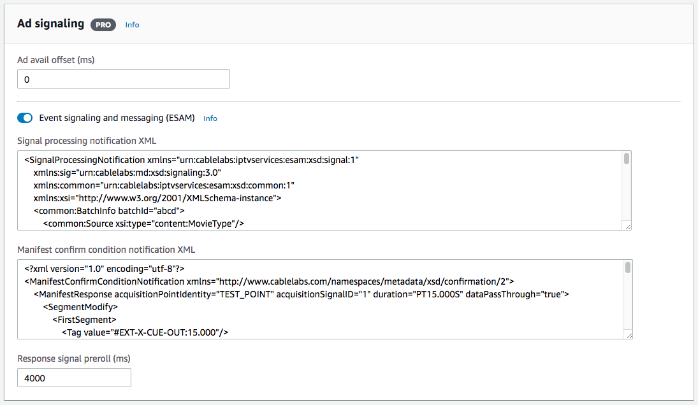
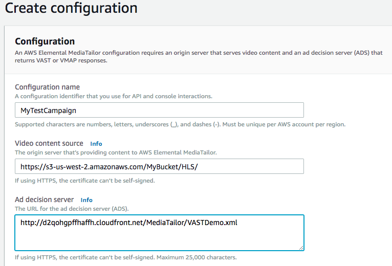

# Monetizing VOD Assets with MediaTailor Through MediaConvert Ad Marker Insertion

MediaConvert now has the capability to let you specify ad insertion points in your outputs. This is incredibly useful if your input video doesn't contain ad markers (SCTE-35 markers) but you still want to monetize your VOD assets or need to enforce blacking out certain content. 

In this tutorial, we show you how to use the ad marker insertion feature in MediaConvert through Event Signaling and Management(ESAM) XML documents. It is important to note that the ad markers you insert will not lengthen the input asset to accomodate for the ad you may want to insert in the future. It will simply mark the position(s) in the stream where these ads should go, or where blackouts should happen. This is something to consider if you want to insert a pre-, mid-, and/or post-roll to your asset without overwriting actual content. 

For the video ad insertion portion of this tutorial, we will take advantage of the manifest conditioning feature in MediaConvert that can be enabled in addition to signal conditioning. HLS manifest from MediaConvert output will have CUE-IN/OUT tags corresponding to the ad markers in the stream. MediaTailor, in turn, will use the HLS manifest decorations to figure out when and where to insert ads coming from an Ad Decision Server(ADS) using VAST. 

## Assumptions and Prerequisites
This tutorial has a few assumptions and prerequisites.

You should be familiar with:
* Event signaling and messaging(ESAM). Refer to [the specification provided by CableLabs](https://specification-search.cablelabs.com/real-time-event-signaling-and-management-api-2?v=03).

You have:
* A bucket in S3 that you have write access to. Referred to in this tutorial as **MyBucket**.
* An IAM role for your MediaConvert job; If not, follow [this tutorial](../1-IAMandS3/README-user.md)

## What's Provided
The tutorial uses and references the following resources:

* [An MP4 asset](https://rodeolabz-us-west-2.s3-us-west-2.amazonaws.com/vodconsole/llama_with_slates.mp4) stored in S3 for input. This asset has a slate for 15 seconds at the beginning (pre-roll), followed by 60 seconds of content, then followed by another slate for 15 seconds (mid-roll), then a slate for 15 seconds at the end (post-roll). It does not have ad markers.
* [Sample VAST response](http://d2qohgpffhaffh.cloudfront.net/MediaTailor/VASTDemo.xml) hosted on S3 as our Ad Decision Server(ADS)
* [Sample signal processing notification XML](emc-sample-signal-notification.xml)  
* [Sample manifest confirm condition notification XML](emc-sample-manifest-conditioning.xml)

## Implementation Instructions

### Create an AWS Elemental MediaConvert Job
#### Inputs section

1. Open the [MediaConvert console](https://us-west-2.console.aws.amazon.com/mediaconvert/home?region=us-west-2#/welcome) for the region you are completing the lab in (US-West-Oregon). 
1. Select **Jobs** from the side bar menu. 
1. Select **Create job** to open the Create job page.
1. Select **Input 1** on the Job panel to open the form for Input 1.
1. Enter the file name `s3://rodeolabz-us-west-2/vodconsole/llama_with_slates.mp4` in the box under Input 

#### Add an Apple HLS Output Group
For simplicity, we will only have one output to this HLS output group.

1. Under **Output Groups** on the Job panel, select **Add**.
1. Check the **Apple HLS** box then click on **Select**.
1. Make sure **Apple HLS** is selected in the Job panel in the Output groups section so that Apple HLS form is loaded.
1. Fill in `HLS` in the **Custom group name** box.
1. In the **Destination** textbox, point to your S3 bucket and give it a path like:
    `s3://MyBucket/HLS/llama`
1. Under **Segment Control**, set the **Minimum segment length** to `3`. This is to help ad marker and content segment alignment.
	
	
1. Select Output 1 from the Output Groups section Jobs panel to go to the Output settings form.
1. Enter `_720` in the **Name modifier** box
1. Enter `$dt$` in the **Segment modifier** box.
1. Scroll down to the **Stream settings** panel and enter `1280` and `720` in the **Resolution (w x h)** box
1. Scroll down to the **Bitrate (bits/s)** box and enter `3000000`.

#### Job settings section

1. Select **Settings** from the **Job settings** section of the Job panel to open the **Job settings** form.
1. Select the MediaConvert role you've previously created from the **IAM role** dropdown.

    
1. Scroll down to the **Ad signaling** section. Enable **Event signaling and messaging (ESAM)**.
1. Under **Signal processing notification XML**, copy/paste the content of [this XML](emc-sample-signal-notification.xml) into the textbox.
1. Under **Manifest confirm condition notification XML**, copy/paste the content of [this XML](emc-sample-manifest-conditioning.xml) into the textbox.

	

#### Create the job
1. Scroll to the bottom of the page and select **Create**
1. Wait for the job to complete.  Monitor the status of the job by refreshing the **Job details** page using the **refresh** button. 

#### View outputs in S3  

1. In the AWS Management Console choose **Services** then select **S3** under Storage.
1. Select the bucket you chose for your output destination.  You should find a folder called `HLS`. Your HLS outputs should be in there. 
1. If your bucket is not publicly accessible, select all the outputs, and under **Actions**, select **Make public**.

### Insert ads
At this point, we have put markers in the HLS transport stream, as well as CUE-IN/OUT tags in the manifest,  corresponding to the slates in our asset. Let's now replace those slates with actual ads with the help of MediaTailor. 

#### Create an AWS Elemental MediaTailor Configuration 

1. From the AWS Management Console, choose **Services** then select **MediaTailor**. 
1. Click on **Create configuration**.
1. Enter `MyTestCampaign` for the **Configuration  Name**.
1. For the **Video content source**, enter the S3 URL link to your HLS asset but  **_without the manifest filename_**. Should look something like below, making sure to replace `MyBucket` with the name of your bucket: 
`https://s3-us-west-2.amazonaws.com/MyBucket/HLS/` 

1. Enter `http://d2qohgpffhaffh.cloudfront.net/MediaTailor/VASTDemo.xml` for the **Ad decision server**. 

	

1. Click **Create Configuration**. Click on the **Configurations** link to see the configuration you just created. Click on **MyTestCampaign** to see the **Playback endpoints** populated with playback URLs. Note down the **HLS playback prefix** as you'll need it in the next section.

#### 2. Test MediaTailor Playback 
1. To verify that ads are making it into your video, you may use a standalone video player to view the HLS playback endpoint such as QuickTime, VLC or any workstation-based player that supports HLS. Alternatively, you may use one of the following web-based players to stream your video: 

	* http://videojs.github.io/videojs-contrib-hls/
	* https://developer.jwplayer.com/tools/stream-tester/

1. Your full playback URL will be the **HLS playback prefix** (eg. _https://f445cfa805184f3e8d86dc2ac1137efa.mediatailor.us-west-2.amazonaws.com/v1/master/cf6421621b389b384c1fd22e51603ee95db76ae0/MyTestCampaign/_)
concatenated with the **manifest filename of the asset in S3** (eg. _llama.m3u8_) 

	Provide the full playback URL to the player of your choice (eg.   _https://f445cfa805184f3e8d86dc2ac1137efa.mediatailor.us-west-2.amazonaws.com/v1/master/cf6421621b389b384c1fd22e51603ee95db76ae0/MyTestCampaign/llama.m3u8_)
1. You should see an ad in place of the slates for the pre-, mid-, and post-roll.

## Completion
Congratulations! You've successfully added ad markers to your asset, and monetized your content.

Return to the [main](../README.md) page.

## Resource Clean Up

### AWS Elemental MediaTailor
Select the configuration you created and hit the **Delete** button to clean up your resources.

### Amazon S3
Once you're done viewing and testing your HLS output, navigate to your S3 bucket and delete the HLS segments and manifest.

## References
* [Event signaling and Messaging(ESAM) specification from CableLabs](https://specification-search.cablelabs.com/real-time-event-signaling-and-management-api-2?v=03)
* [Documentation on including SCTE-35 markers in MediaConvert outputs](https://docs.aws.amazon.com/mediaconvert/latest/ug/including-scte-35-markers.html)
* [VOD content ad behavior in MediaTailor](https://docs.aws.amazon.com/mediatailor/latest/ug/ad-behavior-vod.html)

