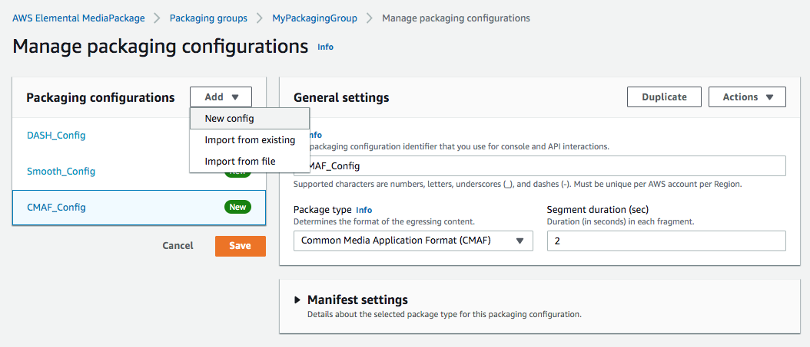
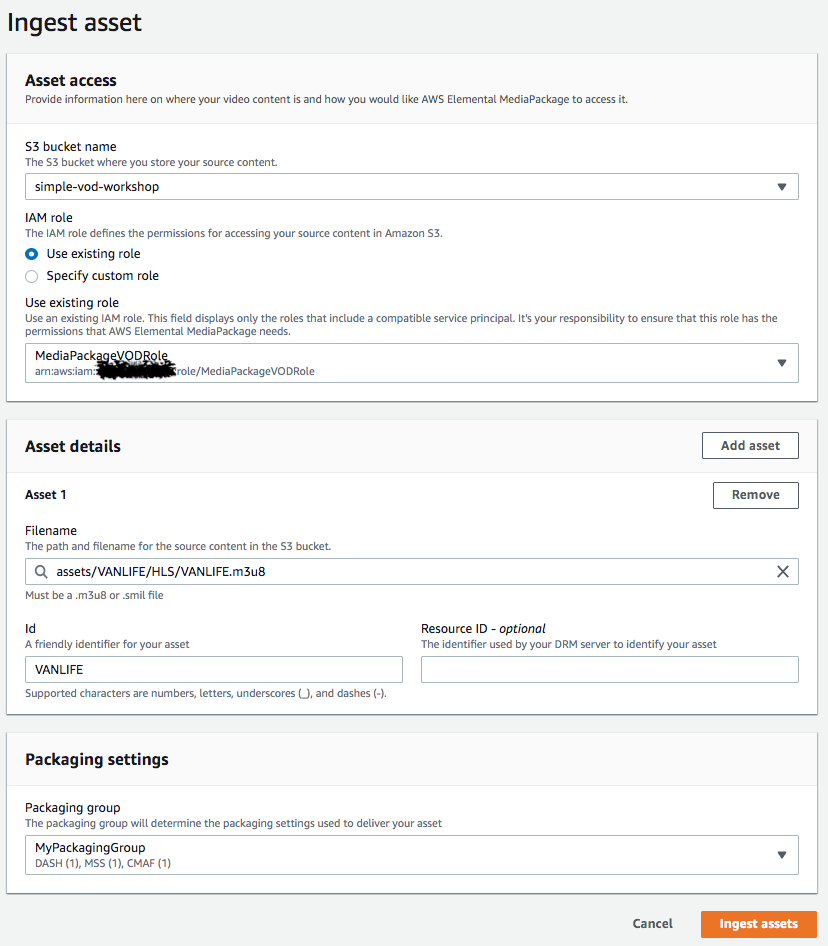
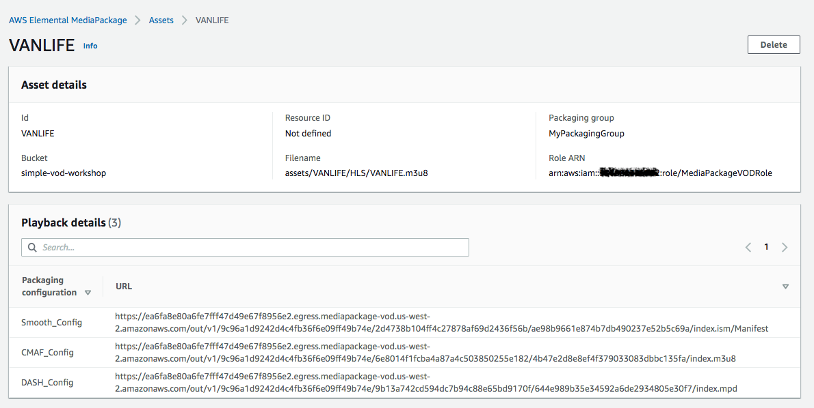

# Delivering VOD Content from AWS Elemental MediaPackage
AWS Elemental MediaPackage can now package, encrypt, and originate on-demand video. This means you can package file-based video to multiple distribution formats without having to transcode video again. A video asset can be ingested into a MediaPackage VOD pacakaging group, and made available for playback on a variety of devices. The MediaPackage VOD workflow lends itself well as a MediaConvert job post-process for jobs that output HLS. 

In this tutorial, we walk you through ingesting an HLS asset you have transcoded through MediaConvert for further packaging through the MediaPackage console. If you'd like to see how this could be done using a CloudWatch event rule and a Lambda, [follow this other tutorial](README.md).

## Assumptions and Prerequisites
* Completion of [2-MediaConvertJobs](../2-MediaConvertJobs/README.md)

## Implementation Instructions

### Give MediaPackage access to S3
You want to give MediaPackage access to the S3 bucket MediaConvert has been using to write outputs.

1. Follow the instructions here carefully: https://docs.aws.amazon.com/mediapackage/latest/ug/setting-up-create-trust-rel.html. At the last section, make sure that your trusted service is **mediapackage.amazonaws.com** as shown in the JSON policy document. 
1. Note the MediaPackage role name you created.

### Create a Packaging Group
1. From the MediaPackage console, expand the **Video on Demand** menu on the left hand side navigation. 
1. Click on **Packaging Groups**.
1. Click on **Create** button. 
1. Enter `MyPackagingGroup` for the Packaging Group Id and click the **Create** button.
1. Under **General Settings** in the Manage Packaging Configuration window, enter `DASH_Config` for the Id. 
1. Under **Package Type**, select `DASH-ISO`.
1. On the left hand side navigation, click on **Add**, and select **New Config** to add another configuration. 
1. Under **General Settings**, enter `Smooth_Config` for the Id.
1. Under **Package Type**, select `Microsoft Smooth`.
1. On the left hand side navigation, click on **Add**, and select **New Config** to add another configuration. 
1. Under **General Settings**, enter `CMAF_Config` for the Id.
1. Under **Package Type**, select `Common Media Application Format(CMAF)`.
1. Click on **Save** button.

    

### Ingest an Asset
1. From the MediaPackage console, expand the **Video on Demand** menu on the left hand side navigation. 
1. Click on **Assets**.
1. Click on **Ingest Asset** button.
1. Under **S3 bucket name**, select the bucket where MediaConvert wrote your HLS output. 
1. Under **IAM Role**, select the MediaPackage role you created at the beginning of this tutorial.
1. Under **Asset Details**, select `assets/VANLIFE/HLS/VANLIFE.m3u8` from the dropdown for the **Filename**. 
1. Under **Packaging Settings**, select the packaging group you created earlier `MyPackagingGroup` from the dropdown.
1. Click on **Ingest Assets** button. 

    

### Playback the MediaPackage Endpoints
We will use a demo player to play back the various endpoints created by MediaPackage.
1. Back on the Assets page, select the Asset you just created.
1. You should find the endpoints created by MediaPackage under **Playback details**. There should be one endpoint for each of the configuration you set up in your packaging group. 
    
1. Copy the URL of the first ingest endpoint. 
1. Navigate to `https://rodeolabz-us-west-2.s3-us-west-2.amazonaws.com/reinvent2019/vodplayer.html`
1. Paste the URL you copied on to the Custom URL textbox and hit the Preview button.
1. Preview the rest of the endpoints. 

    