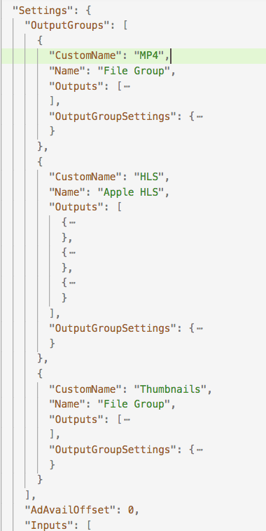

# Exporting and Importing AWS Elemental MediaConvert Jobs

Completed MediaConvert jobs remain on the Jobs page for three months. If you want to be able to run a new job based on a completed job more than three months after you run it, export the job after it has completed and save it. 

Depending on how many jobs you've already ran, exporting and then importing a job can be simpler than finding a particular job in your list and duplicating it.

There are a few other reasons you might want to export a completed job. You want to:
* Run the same job in a different region it was originally ran in
* Run the same job in a different account 
* Use the exported JSON as a starting point for automating job creation

## Prerequisites

A completed MediaConvert job available through the console. 
If you've not run a MediaConvert job before, follow [this tutorial](README.md).

## Export a Completed Job

1. From the MediaConvert Jobs page, click on one of the jobs that you ran and has completed.
1. On the Job Summary page, click on the  **Export JSON** button. 
1. Save the JSON file on your local machine, noting the location where you saved.
1. Open this saved file using your favorite editor. Let's make a small edit to the job before importing it back into MediaConvert.
1. Under the **Settings** key, you'll find the output groups of the job. 
1. Rearrange the output groups so that a different output group is at the top. 

    

1. Save the file.

## Import the Saved Job

1. From the MediaConvert Jobs page, click on **Import Job**.

1. Upload the exported job file (JSON) that you just edited  and saved.

1. Confirm that the order of the Output Groups is now in the order you set it to.

1. Scroll to the bottom and click on **Create**. 

1. Job should complete without errors.