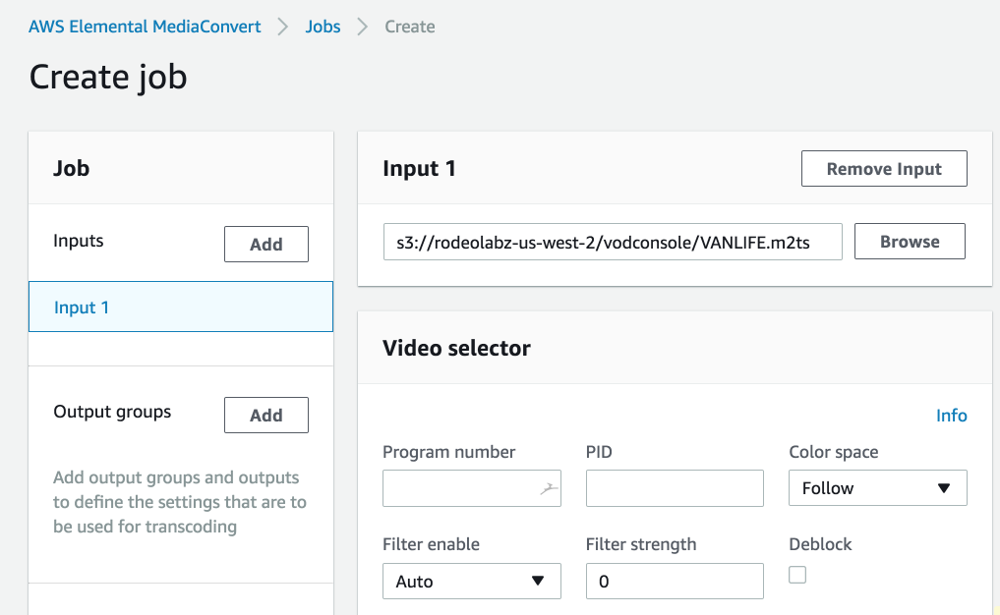
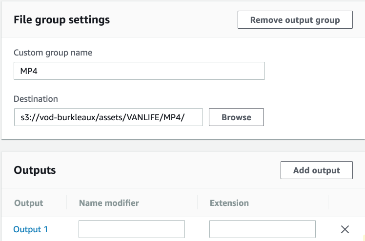
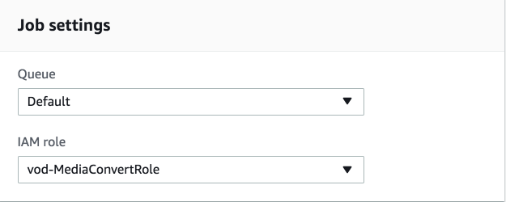
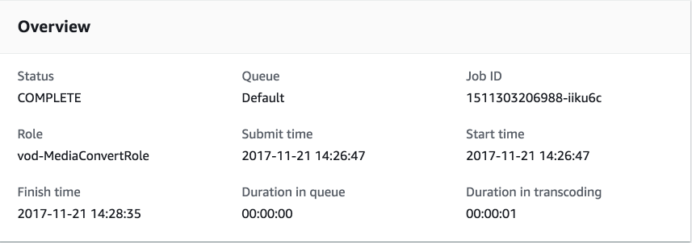
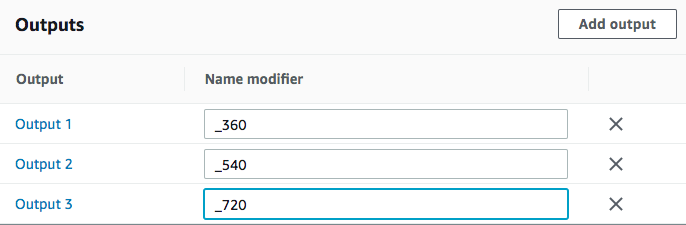
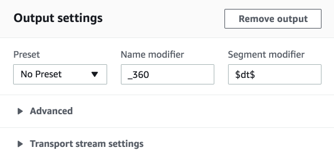
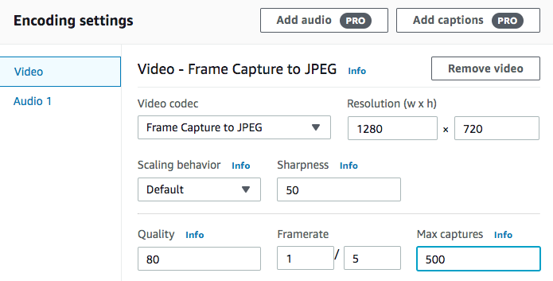
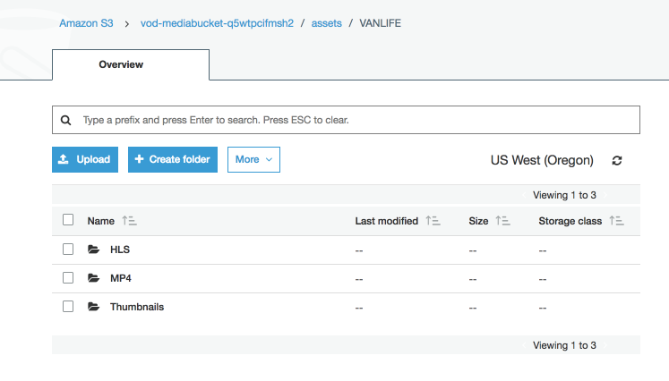
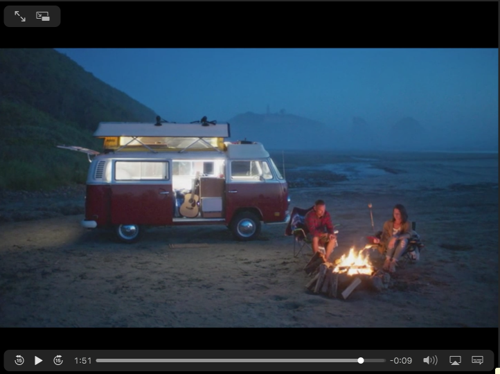

# Module 2: AWS Elemental MediaConvert Jobs

Whether you are working with video for a web application, an Over the Top (OTT, i.e. via the internet) platform, or for broadcast cable, you will need to deliver the video in some standard format that ensures a high quality and consistent experience to viewers. Broadcast and OTT video platforms, such as cable TV channels and Apple TV, specify, in detail, the video features, packaging and encoding that their platforms can decode and play out.  MediaConvert provides the mechanism for converting videos to formats that conform to these policies. 

Example of an OTT video standard:
    
* The [HLS Authoring Specification for Apple Devices](https://developer.apple.com/library/content/documentation/General/Reference/HLSAuthoringSpec/index.html#//apple_ref/doc/uid/TP40016596) gives details about the component outputs of adaptive bitrate stacks supported by Apple devices including information about codecs, bitrates, and resolutions they support.

Example of a broadcast video standard:

* The [CableLabs Mezzanine Encoding Specification](https://apps.cablelabs.com/specification/mezzanine-encoding-specification) specifies a standard for encoding and packaging for video content that will be exchanged and reused by downstream workflows.   For example, you might choose this standard if you wanted to archive news videos in a content management system and then resell them to downstream consumers. 

In this module, you'll use AWS Elemental MediaConvert to convert videos into different formats that enable efficient storage, distribution, and reuse of a video in a variety of workflows.  You'll learn how to use MediaConvert to convert a video into output formats suitable for both file-based and adaptive bitrate, streaming playout, as well as creating thumbnails of the video.

## Prerequisites

You need to have access to MediaConvert and S3 to complete this module. 

You need the following resources created in module 1:
* **MediaConvertRole** - the role created to give permission for MediaConvert to access resources in your account.
* **MediaBucket** - the bucket created to store outputs from MediaConvert

If you used CloudFormation to configure resources, you will find the values names of MediaConvertRole and MediaBucket in the Outputs of the CloudFormation stack.


## 1. Create a MediaConvert Job

A MediaConvert job reads an input video from S3 and converts the video to multiple output groups that in turn can have multiple outputs.  A single media convert job can create multiple versions of the input video in different codecs and packages. 

In this module, you will create a MediaConvert job that take a single input video and converts the video into three output groups as shown in the diagram below:


**Apple HLS Group** - this is an example of an _adaptive bitrate stack_ that encodes the source into multiple files at different data rates and divides them into short chunks, usually between 5-10 seconds long. These are loaded onto an HTTP server along with a text-based manifest file with a .M3U8 extension that directs the player to additional manifest files for each of the encoded streams.  

**File Group - MP4** - this group produces a single MP4 file that must be downloaded entirely by the player for decoding and playback.  MP4 is a common _mezzanine_ (i.e. intermediate storage) format.  It  is also commonly used for video resources on the internet.

**File Group - Thumbnails** -  this group produces JPEG images files, captured every few seconds, from the input video.  Thumbnail images can be used for presentaion of the video in websites or as input to downstream tasks such as analytics with AWS Rekognition. 

### Detailed Instructions

#### Inputs section

1. Open the MediaConvert console for the region you are completing the lab in (US-West-Oregon). https://us-west-2.console.aws.amazon.com/mediaconvert/home?region=us-west-2#/welcome
1. Select **Jobs** from the side bar menu. 
1. Select **Create job** to open the Create job page.
1. Select **Input 1** on the Job panel to open the form for Input 1.
1. Enter the file name `s3://rodeolabz-us-west-2/vodconsole/VANLIFE.m2ts` in the box under Input 1. 

    

#### MP4 File Output Group 

1. Under **Output Groups** on the Job panel, select **Add**.
1. Check the **File group** box then click on **Select**.
1. Make sure **File Group** is selected in the Job panel under in the Output groups section to select the **File group settings** form.
1. Fill in `MP4` in the **Custom group name** box.
1. Use the bucket name you saved from the previous module to construct the output S3 path as follows:
    
    ```
    s3://<MediaBucket>/assets/VANLIFE/MP4/
    ```

1. Fill in the resulting output S3 path in the **Destination** box.
1. Leave the remaining settings as the default.
    
    

1. Select Output 1 from the File Output group in the Output Groups section of the Jobs panel to go to the Output settings form for Output 1.
1. Scroll down to the **Encoding settings** panel and enter `1280` and `720` in the **Resolution (w x h)** box
1. Change the **Rate control mode** from CBR to **QVBR**.  
1. Enter `3000000` for the **Max birate (bit/s)**.
1. Leave all other settings for Output 1 as the default.

#### Job settings section

1. Select **Settings** from the **Job settings** section of the Job panel to open the **Job settings** form.
1. Select the role you created in the previous section of this lab from the **IAM** dropdown.

    

#### Create the job with only the MP4 output 

At this point, we will test our job settings with just the MP4 output to make sure everything is working.  In the next step, we will create a duplicate job and add the HLS and Thumbnails outputs.  This step is not nescessary, but lets us test our role and bucket permissions without having to input alot of settings.

1. Scroll to the bottom of the page and select **Create**
2. Wait for the job to complete.  Monitor the status of the job by refreshing the **Job summary** page using the **refresh** button. 

    

#### Duplicate the job from the previous section

1. From the **Job summary** page for the job that just completed, select the **Duplicate** button.  This creates a new job with the same settings as the original job.

#### Add an Apple HLS Output Group

1. Under **Output Groups** on the Job panel, select **Add**.
2. Check the **Apple HLS** box then click on **Select**.
3. Make sure **Apple HLS** is selected in the Job panel in the Output groups section so that Apple HLS form is loaded.
4. Fill in `HLS` in the **Custom group name** box.
5. Use the bucket name you saved from the previous module to construct the output S3 path as follows:
    
    ```
    s3://<MediaBucket>/assets/VANLIFE/HLS/
    ```

6. Fill in the resulting output S3 path in the **Destination** box.
7. Leave the remaining settings as the default.
8. Scroll down to the **Outputs** panel and click on **Add output** two times so that there are a total of three outputs.

    

9. Select Output 1 from the Output Groups section Jobs panel to go to the Output settings form for Output 1.
10. Enter `_360` in the **Name modifier** box
11. Enter `$dt$` in the **Segment modifier** box.  Note: the reason we need to do this is that we will be using the same output location for our output files.  This will prevent us from reading in segments left over from another, longer, video that was written to the same folder.

    

12. Scroll down to the **Stream settings** panel and enter `640` and `360` in the **Resolution (w x h)** box
13. Scroll down **Rate Control Mode** and set it to **QVBR**. Set **Max bitrate(bits/s)** box to `1000000`.
14. Select Output 2 from the Output Groups section Jobs panel to go to the Output settings form for Output 2.
15. Enter `_540` in the **Name modifier** box
16. Enter `$dt$` in the **Segment modifier** box.
17. Scroll down to the **Stream settings** panel and enter `960` and `540` in the **Resolution (w x h)** box
18. Scroll down **Rate Control Mode** and set it to **QVBR**. Set **Max bitrate(bits/s)** box to `2000000`.
19. Select Output 3 from the Output Groups section Jobs panel to go to the Output settings form for Output 3.
20. Enter `_720` in the **Name modifier** box
21. Enter `$dt$` in the **Segment modifier** box.
22. Scroll down to the **Stream settings** panel and enter `1280` and `720` in the **Resolution (w x h)** box
23. Scroll down **Rate Control Mode** and set it to **QVBR**. Set **Max bitrate(bits/s)** box to `3000000`.


#### Add a Thumbnail Output Group

1. Under **Output Groups** on the Job panel, select **Add**.
1. Check the **File group** box then click on **Select**.
1. Make sure the second **File Group** is selected in the Job panel under in the Output groups section to select the **File group settings** form.
1. Fill in `Thumbnails` in the **Custom group name** box.
1. Use the bucket name you saved from the previous module to construct the output S3 path as follows:
    
    ```
    s3://<MediaBucket>/assets/VANLIFE/Thumbnails/
    ```

1. Fill in the resulting output S3 path in the **Destination** box.
1. Select the **Output 1** link from the **Outputs** box to go to the **Output settings** form for Output 1.
1. Under **Output settings**, select **No container** from the **Container** dropdown.
1. Scroll down to the **Encoding settings** panel.
1. Select **Frame Capture to JPEG** from the **Video codec** dropdown.
1. Enter `1280` and `720` in the **Resolution (wxh)** boxes.
1. Enter `500` in the **Max captures** box.
    
    

1. Select the **Audio 1** from the **Stream settings** side bar menu.  
1. Select **Remove audio**.

#### Job settings section

1. Select **Settings** from the **Job settings** section of the Job panel to open the **Job settings** form.
1. Select the role you created in the previous section of this lab from the **IAM** dropdown.

    

#### Create the job

1. Scroll to the bottom of the page and select **Create**
1. Wait for the job to complete.  Monitor the status of the job by refreshing the **Job details** page using the **refresh** button. 

    


## 2. View outputs in S3  

1. In the AWS Management Console choose **Services** then select **S3** under Storage.
2. Select the bucket where your output files are located.  You should find a folder called `assets/VANLIFE/` with subfolders for `HLS`, `MP4` and `Thumbnails`.
3. **Save this page open in a browser tab** so you can access videos for playout in later modules.



NOTE: You can also access the S3 bucket for each output group using the links in the **Outputs** section of the MediaConvert console **Job details** page.

## 3. Play the videos

To play the videos, you will use the S3 HTTPS resource **Link** on the videos S3 object **Overview** page.


#### MP4s

The MP4 output is located in your ouput s3 bucket in the object: s3://YOUR-MediaBucket/assets/VANLIFE/MP4/VANLIFE.mp4

You can play the MP4 using:
* Chrome by clicking on the **Link** for the object.
* **JW Player Stream Tester** by copying the link for the object and inputing it to the player. https://developer.jwplayer.com/tools/stream-tester/ 

#### HLS

The HLS manifest file is located in your ouput s3 bucket in the object: s3://YOUR-MediaBucket/assets/VANLIFE/HLS/VANLIFE.m3u8

You can play the HLS using:
* Safari browser by clicking on the **Link** for the object.
* **JW Player Stream Tester** - by copying the link for the object and inputing it to the player.  https://developer.jwplayer.com/tools/stream-tester/ 

#### Thumbnails

You should be able to view thumbnail JPEG files using your browser.

### Video preview

There should be HLS, MP4 and Thumbnail outputs of the VANLIFE video.




## Completion

Congratulations!  You have successfully created video conversion job for AWS Elemental MediaConvert. Move forward to the next module to work with input to add clipping and stitching to your job.

Next module: [**Modifying AWS Elemental MediaConvert Inputs**](../3-Inputs/README.md) 

You may also be interested in the following activities:

* [Testing HLS Video](../9-TestingHLS/README.md)
