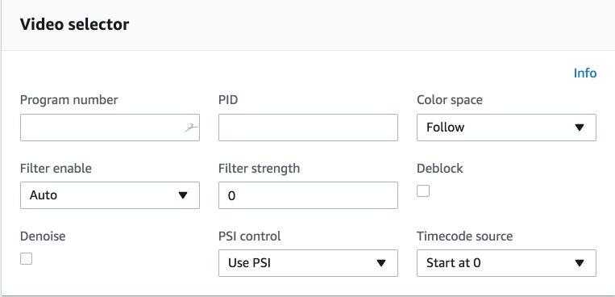
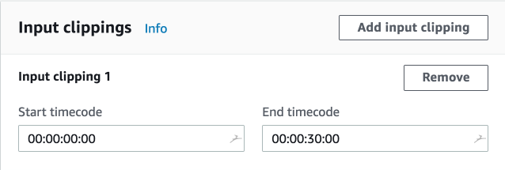
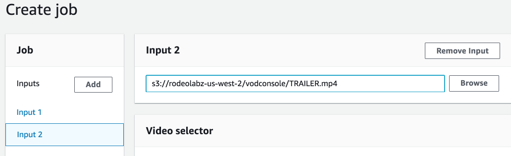
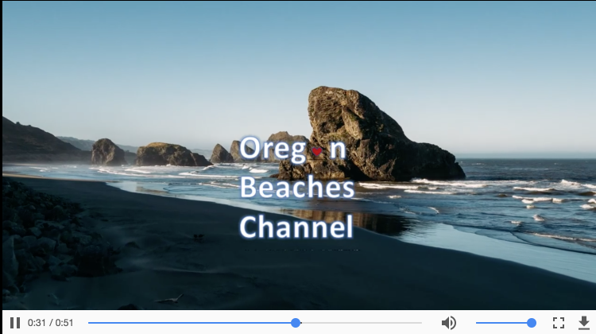

# Module 3: Modifying AWS Elemental MediaConvert Inputs

In this section we will introduce an example of how video inputs can be modified as part of encoding and packaging with MediaConvert.

Video content often needs to be combined or _stitched_ with other videos.  For example, if you have a YouTube channel, you may want to always play a channel clip at the begining of a piece of content and invite viewers to subscribe to the channel or promote other content at the end of each piece of content.  These are referred to as _bumper_ videos.

Sometimes you may also want to clip the input videos before you stitch them together.  For example, you want to make a _sizzle reel_ that combines multiple clips of larger videos into a single video you can use for promotion.

In this module you'll modify the AWS Elemental MediaConvert job you created in the last module to combine several video inputs into a single video.  

## Prerequisites

You need to have access to MediaConvert and S3 to complete this module. 

You need the following resources created in module 1:
* **MediaConvertRole** - the role created to give permission for MediaConvert to access resources in your account.
* **MediaBucket** - the bucket created to store outputs from MediaConvert.
* **MediaConvert job from module 2** - We will start with this job and modify it in this module.

If you used CloudFormation to configure resources, you will find the values names of MediaConvertRole and MediaBucket in the Outputs of the Stack.

## 1. Modify a MediaConvert job to add input clipping and stitching

Create duplicate of the job you created in module 2.  Modify the job to clip the first minute of the vanlife video and then stitch on a trailing video at the end.  The new job will have the following structure:

#### Detailed instructions 

#### Duplicate the job from the previous module

1. Open the MediaConvert console for the region you are completing the lab in (US-West-Oregon). https://us-west-2.console.aws.amazon.com/mediaconvert/home?region=us-west-2#/welcome
1. Select **Jobs** from the side bar menu. 
1. Find the job  you created in the last module and click on the Job Id link to open the **Job details** page.
1. Select **Duplicate**

#### Clip the first 30 seconds of the Input 1 video

1. Select **Input 1** from the menu sidebar.
1. Scroll down to the **Video selector** panel and select **Start at 0** from the **Timecode source** dropdown.

    
1. Scroll down to the **Input clips** panel and select **Add input clip**.
1. Enter `00:00:00:00` in the **Start timecode** box for **Input clipping 1**
1. Enter `00:00:30:00` in the **End timecode** box for **Input clipping 1**

    

#### Stitch the TRAILER video to the end of the VANLIFE video.

1. In the Input section of the MediaConvert side bar menu, select **Add**.
1. Make sure **Input 2** is selected from the Input section of the MediaConvert side bar menu.
1. Enter `s3://rodeolabz-us-west-2/vodconsole/TRAILER.mp4` in the box on the **Input 2** panel.

    

#### Create the job

1. Scroll to the bottom of the page and select **Create**
1. Wait for the job to complete.  Monitor the status of the job by refreshing the **Job detail** page.  

### 2. Play the videos

To play the videos, you will use the S3 HTTPS resource **Link** on the videos S3 object **Overview** page.

#### MP4s

The MP4 output is located in your ouput s3 bucket in the object: s3://YOUR-MediaBucket/assets/VANLIFE/MP4/VANLIFE.mp4

You can play the MP4 using:
* Chrome by clicking on the **Link** for the object.
* **JW Player Stream Tester** by copying the link for the object and inputing it to the player. https://developer.jwplayer.com/tools/stream-tester/ 

#### HLS

The HLS manifest file is located in your ouput s3 bucket in the object: s3://YOUR-MediaBucket/assets/VANLIFE/HLS/VANLIFE.m3u8

You can play the HLS using:
* Safari browser by clicking on the **Link** for the object.
* **JW Player Stream Tester** - by copying the link for the object and inputing it to the player.  https://developer.jwplayer.com/tools/stream-tester/ 

#### Thumbnails

You should be able to view thumbnail JPEG files using your browser.

### Video preview

The HLS, MP4 and Thumbnail outputs should be modified to play the first 30 seconds of the VANLIFE video, followed by a 21 second clip of aerial footage of some sea stacks.

## Completion

Congratulations!  You have successfully created video conversion job with multiple inputs and outputs for AWS Elemental MediaConvert. Move forward to the next module to add watermarks to your job outputs.

Next module: [**Modifying AWS Elemental MediaConvert Outputs**](../4-Outputs/README.md) 

