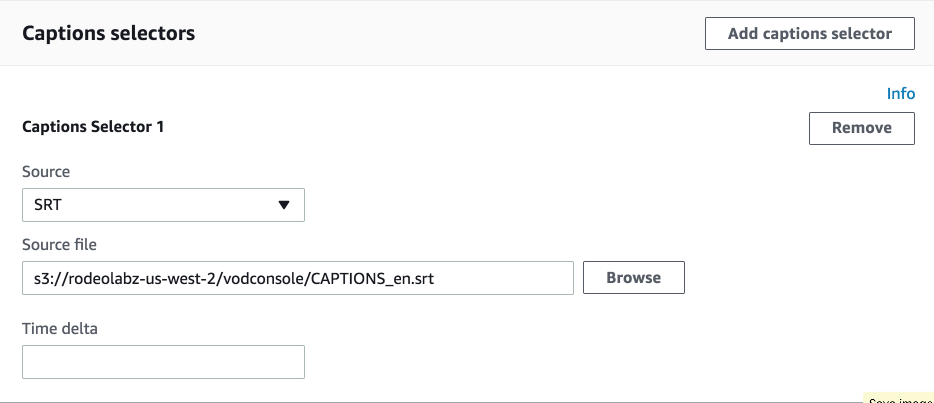
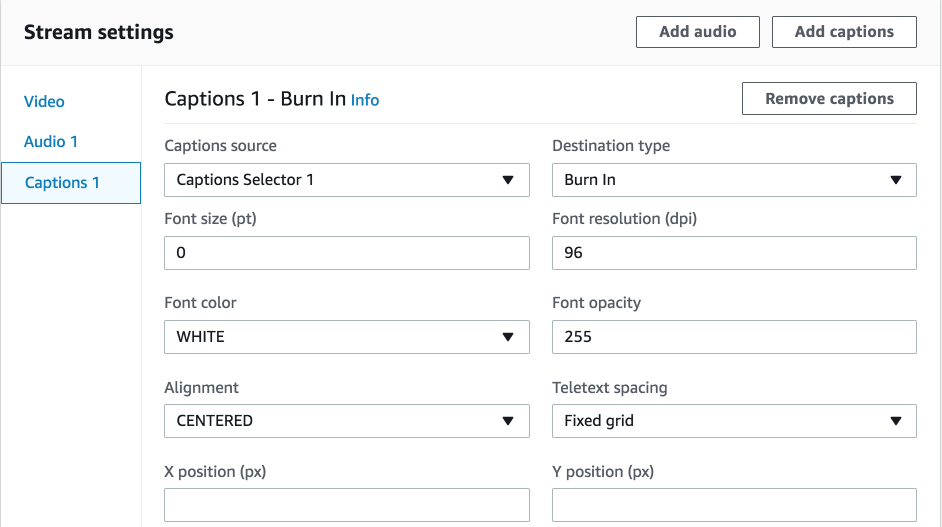
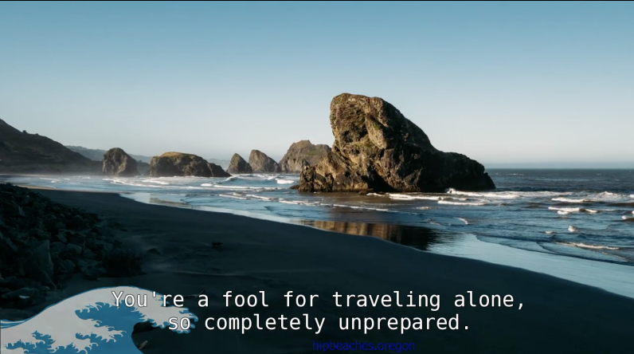

# Module 5: Working with Captions

In this module you will modify one of the outputs created in our base job by adding captions from a side-car SRT file. SRT files are structured text files that contain subtitle information, which includes the sequential number of subtitles, start and end timecode, and subtitle text.  The new job structure will look like this:

You might notice that the captions in this module don't match with the video.  These captions came from a different source video.  

**TRIVIA QUESTION:**  

- What [Blender Foundation Open Movie Project](https://www.blender.org/features/projects/) do the captions we added in this module come from?

**EXTRA CREDIT** 

- After you finish the module try creating your own captions for the VANLIFE video.  Hint: You'll need to edit the captions files in this folder. 

## Prerequisites

You need to have access to MediaConvert and S3 to complete this module. 

You need the following resources created in module 1:
* **MediaConvertRole** - the role created to give permission for MediaConvert to access resources in your account.
* **MediaBucket** - the bucket created to store outputs from MediaConvert.
* **MediaConvert job from module 2 or later** - We will start with this job and modify it in this module.  

If you used CloudFormation to configure resources, you will find the values names of MediaConvertRole and MediaBucket in the Outputs of the Stack.

## 1. Modify the MP4 output to include captions 

#### Duplicate the job from the previous module

1. Open the MediaConvert console for the region you are completing the lab in (US-West-Oregon). https://mediaconvert-console-ext-us-west-2.aws.amazon.com/mediaconvert/home?#/welcome
1. Select **Jobs** from the side bar menu. 
1. Find the job  you created in the last module and click on the Job Id link to open the **Job details** page.
1. Select **Duplicate**

#### Burn in captions to the MP4 output

1. Select **Input 1** from the Input section of the MediaConvert menu side bar to open the **Input settings** form.
1. Scroll down to the **Captions selectors** panel and select **Add caption selector** from the side bar.
1. Select **SRT** from the **Source** dropdown for Caption Selector 1  
1. Enter `s3://rodeolabz-us-west-2/vodconsole/CAPTIONS_en.srt` in the **Source file** box. 

    

1. Select **Output 1** of the **MP4 - File Group** in  the Output Groups section of the MediaConvert menu side bar to open the **Output settings** form for Output 1.
1. Select **Add captions** from the top of the **Stream settings** panel.
1. Make sure **Captions 1** is selected on the side bar of the **Stream settings** panel.
1. Select **Captions selector 1** in the **Captions source** drop down.
1. Select **Burn In** in the **Destination type** drop down.
1. Leave the rest of the settings as the default.
 
    

#### Create the job

1. Scroll to the bottom of the page and select **Create**
1. Wait for the job to complete.  Monitor the status of the job by refreshing the **Job details** page.  

### 2. Play the MP4

To play the videos, you will use the S3 HTTPS resource **Link** on the videos S3 object **Overview** page.

#### MP4s

The MP4 output is located in your ouput s3 bucket in the object: s3://YOUR-MediaBucket/assets/VANLIFE/MP4/VANLIFE.mp4

You can play the MP4 using:
* Chrome by clicking on the **Link** for the object.
* **JW Player Stream Tester** by copying the link for the object and inputing it to the player. https://developer.jwplayer.com/tools/stream-tester/ 

#### Video preview

The MP4 output should be modified with captions.  The HLS and Thumbnails outputs should be unchanged.

## Completion

In this module you added burned in captions to the MP4 output of you MediaConvert job.  Hopefully, you also had a chance to play with captions metadata by making your own captions for the VANLIFE video.  **Did you guess the name of the Blender Foundation Open Movie Project the captions came from?**

Next module: [**Working with Embedded Input Metadata**](../6-EmbeddedMetadata/README.md) 

