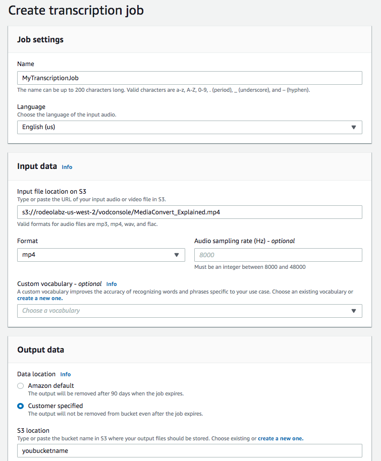
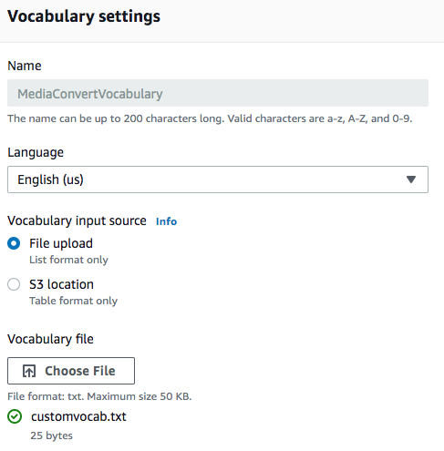
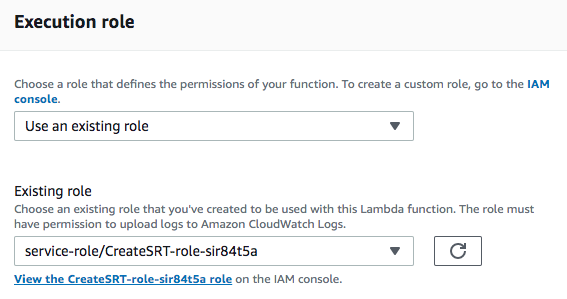
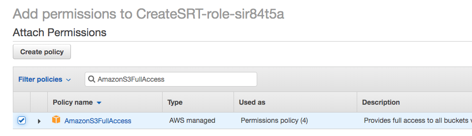
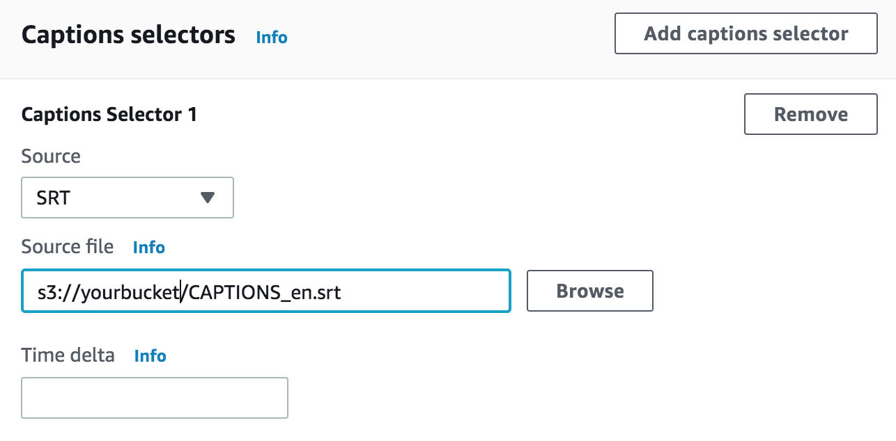
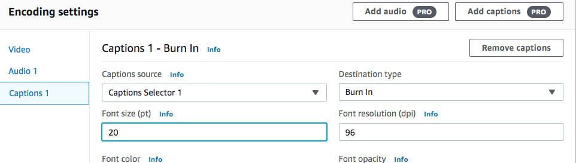
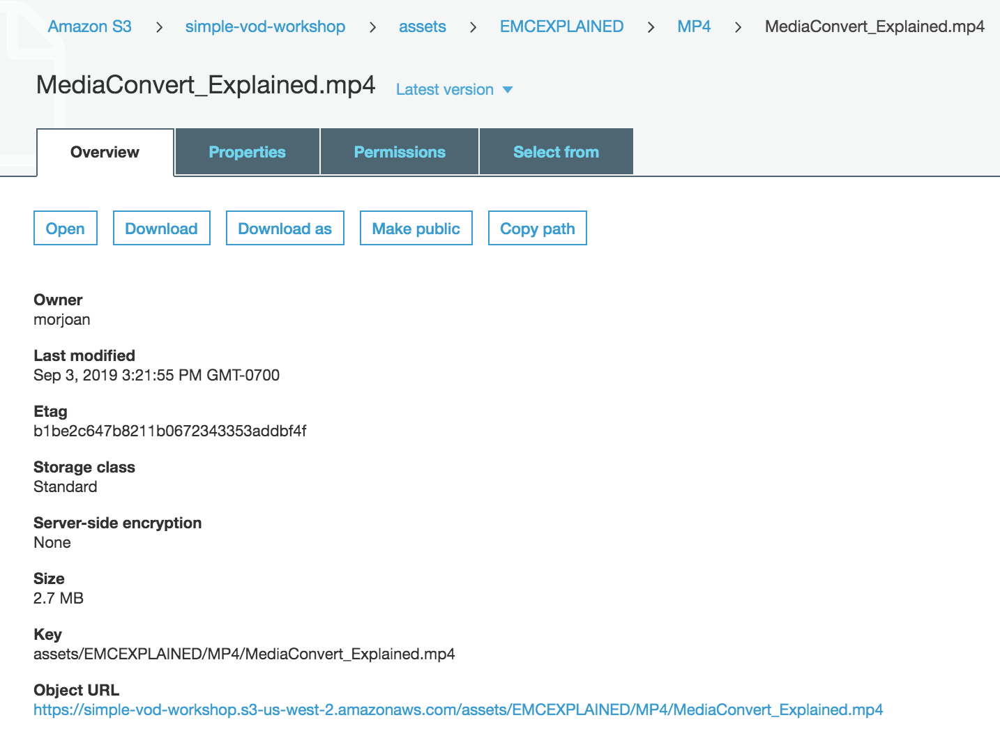

# MediaConvert Captions using Amazon Transcribe

In this module we will create an SRT (SubRip Subtitle files) captions file that we will use to add caption to a MediaConvert job output. SRT files are structured text files that contain subtitle information, which includes the sequential number of subtitles, start and end timecode, and subtitle text.  To create our SRT file, we will take an MP4 file and have Amazon Transcribe create a transcript out of that file. We will run a script that uses scripts from [this GitHub repo](https://github.com/aws-samples/aws-transcribe-captioning-tools/tree/master/tools) against the transcript to generate the SRT file. We will then modify one of the outputs created in our base job by adding captions using our generated side-car SRT file.

## Prerequisites

1. You need to have access to MediaConvert and S3 to complete this module. 

1. You need the following resources created in [module 1](../1-IAMandS3/README.md):
    * **MediaConvertRole** - the role created to give permission for MediaConvert to access resources in your account.
    * **MediaBucket** - the bucket created to store outputs from MediaConvert.
    * **MediaConvert job from module 2 or later** - We will start with this job and modify it in this module.  

## Create a captions file

### Run a Transcribe job
1. From AWS console, navigate to Amazon Transcribe. 
1. From the **Transcription jobs** page, click on **Create job** button.
1. Under **Job Settings**, provide a name like `MyTranscriptionJob`.
1. Under **Input Data**, enter this URL `s3://rodeolabz-us-west-2/vodconsole/MediaConvert_Explained.mp4` for the **Input file location on S3**.
1. Under **Format**, select **MP4**.
1. Under **Output Data**, select **Customer Specified** and provide the bucket name of the bucket you created in Module 1.

    
1. Take the defaults for the rest, and click on **Create** button. 
1. After job completes, click on the output URL under Job details (`https://s3.us-west-2.amazonaws.com/<yourbucket>/MyTranscriptionJob.json`) that got written by the job.
1. Download the file and inspect it with a text editor. 
 
### Re-run Transcribe job with custom vocabulary
You probably noticed that certain words like `Media Convert` and `trance coding` aren't quite what we want in the transcript. We can fix this by providing a custom vocabulary and re-running our Transcribe job.
1. Create a local text file on your machine that has these words, one word per line. 
    `MediaConvert`

    `transcoding`
1. Save the file on your Desktop, or somewhere accessible, and name it something like `customvocab.txt`.
1. From the Transcribe console, click on **Custom Vocabulary** on the left hand side navigation.
1. Click on the **Create Vocabulary** button.
1. Give it a name like `MediaConvertVocabulary`.
1. Click on **Choose file** and upload the local text your created (customvocab.txt).
    
    

1. Once the vocabulary is in a **Ready** state (it will take a few minutes), click on **Transcription jobs** on the left hand side navigation.
1. Select the job you created earlier, and click on the **Copy** button.
1. Under **Input Data**, select the vocabulary you created under **Custom vocabulary** and **Create** the job.
1. After job completes, navigate to the S3 console and go into your bucket. 
1. Select the JSON output (eg. `MyTranscriptionJob-copy.json`) that got written by the job.
1. Download the file and inspect it with a text editor. The incorrect words should now be showing up correctly.  

### Process the transcript output
Once the Transcribe job is completed, we can process the JSON output to create the SRT caption file. 

1. From AWS console, navigate to Lambda.
1. Click on the **Create Function** button.
1. Enter a Function name like `CreateSRT`.
1. Choose **Python 3.7** from the **Runtime** dropdown.
1. Click on **Create function** button.
1. Scroll down to the **Execution role** section.
1. Click on the **View the CreateSRT-role** link. This will take you to the IAM console.
    
    
1. Under **Permissions**, click on the **Attach Policies** button. 
1. Search for `AmazonS3FullAccess` and select the policy.
1. Click on **Attach policy**. This will give Lambda read and write access to your bucket.
    
    
1. Close the IAM console tab, and go back to the **Lambda** console.
1. Scroll up to the **Function code** section. 
1. Under **Code entry type**, select **Upload a file from Amazon S3**. 
1. For the **Amazon S3 link URL**, enter `https://rodeolabz-us-west-2.s3-us-west-2.amazonaws.com/vodconsole/createSRT.zip`
1. Click on **Save** button to save the function.
1. Scroll down and edit the following variables from the lambda_function as needed:
    * **bucket** - set to your bucket name
    * **transcription_job** - set to the output name of your transcription job from Transcribe
1. Click on **Save** button to save your changes.
1. Click on the **Select a test event** dropdown.
1. Select **Configure test events**. 
1. Give the event a name like `TestFunction`.
1. Click on **Create**.
1. Back on the function window, Click on the **Test** button. This will run our Lambda function. 
1. Navigate back to your S3 bucket. Confirm that a file named `CAPTIONS_en.srt` has been created. You may download and open the file with a text editor to inspect the output.

## Modify the MP4 output to include captions 

### Duplicate the job from the previous module

1. Open the MediaConvert console.
1. Select **Jobs** from the side bar menu. 
1. Find the first job you created in the last module (only has an MP4 output) and click on the Job Id link to open the **Job details** page.
1. Select **Duplicate**.

### Burn in captions to the MP4 output

1. Select **Input 1** from the Input section of the MediaConvert menu side bar to open the **Input settings** form.
1. Point your input to `s3://rodeolabz-us-west-2/vodconsole/MediaConvert_Explained.mp4`
1. Scroll down to the **Captions selectors** panel and click on the **Add caption selector** button.
1. Select **SRT** from the **Source** dropdown for Caption Selector 1.  
1. Enter the link to the SRT file you created `s3://<yourbucket>/CAPTIONS_en.srt` in the **Source file** box. Replace _yourbucket_ with name of your bucket.

    

1. Under **Output Groups**, click on **File Group - MP4**.
1. Update the **Destination** to `s3://<yourbucket>/assets/EMCEXPLAINED/MP4/`, replacing _yourbucket_ with your bucket.

1. Select **Output 1** of the **MP4 - File Group** in  the Output Groups section of the MediaConvert menu side bar to open the **Output settings** form for Output 1.
1. Select **Add captions** from the top of the **Encoding settings** panel.
1. Make sure **Captions 1** is selected on the side bar of the **Stream settings** panel.
1. Select **Captions selector 1** in the **Captions source** drop down.
1. Select **Burn In** in the **Destination type** drop down.
1. Set **Font size(pt)** to `20`.
1. Leave the rest of the settings as the default.
 
    

1. Scroll to the bottom of the page and select **Create**
1. Wait for the job to complete.  Monitor the status of the job by refreshing the **Job details** page.  

### Play the MP4

To play the videos, you will use the S3 HTTPS resource **Link** on the videos S3 object **Overview** page.
    
