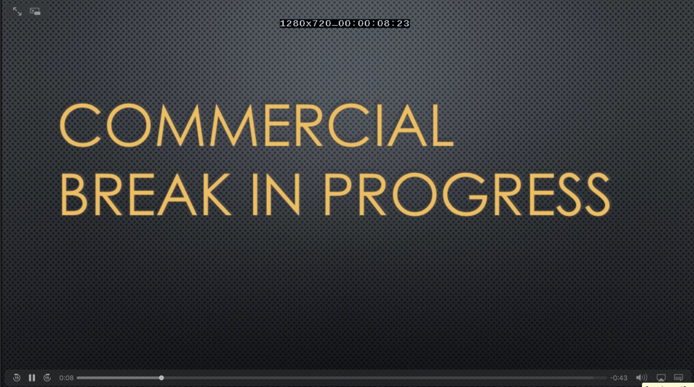

# Module 6: Working with embedded input metadata

The captions you added in the previous module are an example of _side-car_ metadata.  That is, metadata that is stored separately from the video.  Videos can also have _embedded metadata_ that is stored in the video package itself.  In this module, we will look at some common examples of embedded metadata including Ad markers, embedded captions, and multi-language audio tracks.  We will use Ad markers as an example to show how to work with embedded metadata in the video conversion workflow.

The video you have been working with contains 2 language tracks and SCTE35 Ad Markers.  Ad markers show where ads should be located in a video.  Ad marker blanking inserts a visible _slate_ into the slot that is reserved for an Ad.  Ad can be inserted on playout using a packager such as AWS Elemental MediaPackage. 

## Prerequisites

You need to have access to MediaConvert and S3 to complete this module. 

You need the following resources created in module 1:
* **MediaConvertRole** - the role created to give permission for MediaConvert to access resources in your account.
* **MediaBucket** - the bucket created to store outputs from MediaConvert.
* **MediaConvert job from module 2 or later** - We will start with this job and modify it in this module.  

If you used CloudFormation to configure resources, you will find the values names of MediaConvertRole and MediaBucket in the Outputs of the Stack.

## 1. Modify a MediaConvert job to detect SCTE35 markers in the input and blank out embedded Ads

Create a duplicate of the job you created in the last module.  Modify the job to detect add markers and replace any embedded Ads with a slate image.  The new job will have the following structure:

### Detailed instructions 

#### Duplicate the job from the previous module

1. Open the MediaConvert console for the region you are completing the lab in (US-West-Oregon). https://mediaconvert-console-ext-us-west-2.aws.amazon.com/mediaconvert/home?#/welcome
1. Select **Jobs** from the side bar menu. 
1. Find the job  you created in the last module and click on the Job Id link to open the **Job details** page.
1. Select **Duplicate**

#### Enable SCTE35 Ad availability blanking

1. Scroll down to the bottom of the MediaConvert side bar menu and select **Settings** from the **Job settings** section.
1. Scroll down to the **Global processors** panel and toggle the **Ad avail blanking** switch to the **on** position.
1. Enter `s3://rodeolabz-us-west-2/vodconsole/SLATE.png` in the **Blanking image** box.

#### Create the job

1. Scroll to the bottom of the page and select **Create**
1. Wait for the job to complete.  Monitor the status of the job by refreshing the **Job detail** page.  

## 2. Play the videos

Ad markers will now show up in all of the video outputs.

To play the videos, you will use the S3 HTTPS resource **Link** on the videos S3 object **Overview** page.

#### MP4s

The MP4 output is located in your ouput s3 bucket in the object: s3://YOUR-MediaBucket/assets/VANLIFE/MP4/VANLIFE.mp4

You can play the MP4 using:
* Chrome by clicking on the **Link** for the object.
* **JW Player Stream Tester** by copying the link for the object and inputing it to the player. https://developer.jwplayer.com/tools/stream-tester/ 

#### HLS

The HLS manifest file is located in your ouput s3 bucket in the object: s3://YOUR-MediaBucket/assets/VANLIFE/HLS/VANLIFE.m3u8

You can play the HLS using:
* Safari browser by clicking on the **Link** for the object.
* **JW Player Stream Tester** - by copying the link for the object and inputing it to the player.  https://developer.jwplayer.com/tools/stream-tester/ 

#### Video preview

The MP4, HLS and Thumbnails will have one 10 second Ad marker slate image inserted starting 6 seconds into the video.

## Completion

Congratulations!  You finished the lab! Hopefully, you learned something new about video conversion use cases and workflows using AWS Elemental MediaConvert service. 