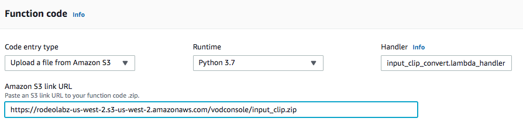
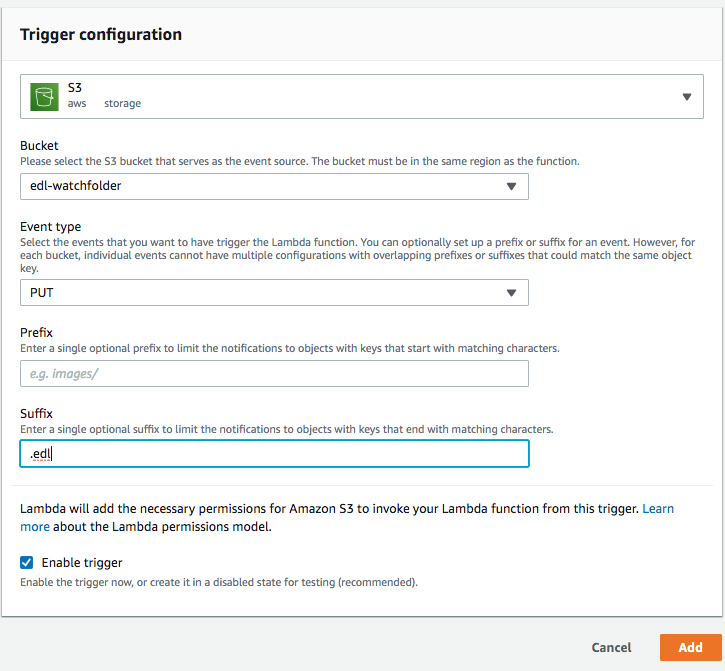
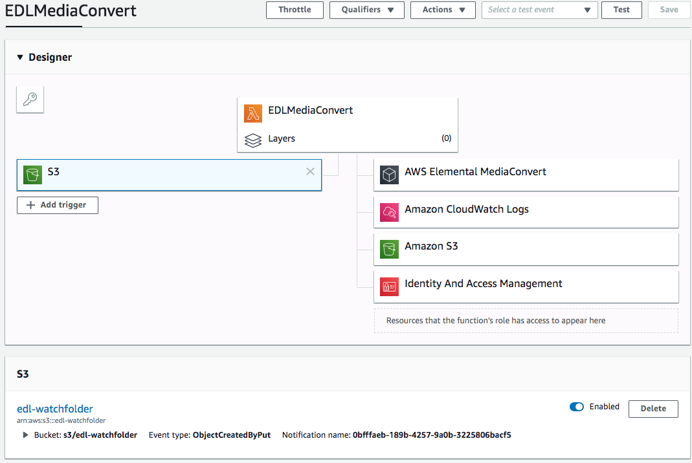
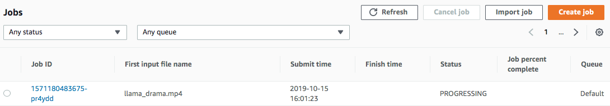

# Using an Edit Decision List(EDL) to Automate MediaConvert Jobs 

In this module, you'll be using Amazon S3 events and a Lambda to automatically trigger AWS Elemental MediaConvert jobs. But instead of keying off of an input video file that's been placed in an S3 bucket, an Edit Decision List (EDL) file placed in S3 will trigger a Lambda that in turn will kick off a MediaConvert encoding job. The files to be used for transcoding are expected to also be placed in the same S3 bucket and path as the EDL file.  

## Background on EDLs
An EDL is used in the post-production process of film and video editing. It contains an ordered list of video and corresponding timecode information on where each video should be clipped to put together the final cut of the film.

Below is a sample EDL which we will be using in this tutorial. It's been generated by Adobe Premiere, a video editing software. This EDL is based on the CMX3600 format, which supports relatively simple editing decisions. We will mostly be using the cut information (signified by **C**, in the 4th column of the EDL sample below) which MediaConvert supports through its input clipping feature. Information about the CMX3600 format relevant to the sample below can be found in pages 10 - 14 of the [specification](http://xmil.biz/EDL-X/CMX3600.pdf). 

    1     TITLE: llama-ad-llama
    2     FCM: NON-DROP FRAME
    3
    4     001  AX       V     C        00:00:00:00 00:00:45:00 00:00:00:00 00:00:45:00
    5     * FROM CLIP NAME: llama_drama.mp4
    6
    7     002  AX       V     C        00:00:00:00 00:00:15:00 00:00:45:00 00:01:00:00
    8     * FROM CLIP NAME: ad_caribbean.mp4
    9
    10    003  AX       V     C        00:00:45:00 00:01:30:00 00:01:00:00 00:01:45:00
    11    * FROM CLIP NAME: llama_drama.mp4
 
The lines starting with a numerical ID (lines 4, 7, and 10) contain the clipping information for the asset specified in the very next line. Columns 5 and 6 are the start and end timecode, respectively, for the input clipping. This information will be used to put together a MediaConvert job that will stitch all the input videos together at the specified clip times. Based on the data in the above EDL, we should end up with a video that has the first 45 seconds of the llama_drama video, followed by a 15-second ad video, and then the last 45 seconds of the same llama_drama clip. 

The Lambda function you will create will be invoked each time a user uploads an EDL and the input videos contained in the EDL. The lambda will create a MediaConvert job to produce several outputs:

- An Apple HLS adaptive bitrate stream for playout on multiple sized devices and varying bandwidths.
- An MP4 stream
- Thumbnails for use in websites to show a preview of the video at a point in time.

## Prerequisites
This module assumes you have completed the following previous modules:
* [1-IAMandS3](../1-IAMandS3/README.md) - note the output S3 bucket and IAM role ARN created in this module
* [7-MediaConvertJobLambda](README.md) - note the Lambda role ARN created in this module

### Create an Amazon S3 bucket

Use the console to create a bucket where you're going to upload your video input files, as well as your EDL file. Remember that a bucket's name must be globally unique across all regions and customers. We recommend using a name like `edl-watchfolder-firstname-lastname`. If you get an error that your bucket name already exists, try adding additional numbers or characters until you find an unused name.

1. In the AWS Management Console, choose **Services** then select **S3** under Storage.
1. Choose **+Create Bucket**
1. Provide a globally unique name for your bucket such as `edl-watchfolder-firstname-lastname`.
1. Select the Region you've chosen to use for this workshop from the dropdown.
1. Choose **Create** in the lower left of the dialog without selecting a bucket to copy settings from.

### Create the Lambda Function 
In this step you'll build the core function that will process the EDL and create a MediaConvert job using the python SDK. The Lambda function will respond to putObject events in your S3 source bucket.  Whenever an EDL file is added, the Lambda will start a MediaConvert job, but it won't wait for the job to complete.   

#### Step-by-step instructions 

1. From the AWS console, choose **Services** then select **Lambda**.
1. Click on **Create function**.
1. In the **Basic Information** section, enter `EDLMediaConvert` in the **Function name** field.
1. Select **Python 3.7** for the **Runtime**.
1. Expand the **Choose or create an execution role** section in the **Permissions** section. 
1. Select **Use an existing role**. 
1. Select `VODLambdaRole` from the **Existing Role** dropdown. This should be the same role that you created in an [earlier module](README.md#vod-lambda-role).
1. Click on **Create function**.

    

1. On the Configuration tab of the `EDLMediaConvert` page, in the  **function code** panel:  

    a. Select **Upload a file from Amazon S3** for the **Code entry type**
    
    b. Enter the following for the URL: `https://rodeolabz-us-west-2.s3-us-west-2.amazonaws.com/vodconsole/input_clip.zip`. 
    
    _Note that this zip file is simply the [input_clip_convert.py script](input_clip_convert.py) and the [input clip job JSON](input_clipping_job.json) file provided in this repo that you could zip up yourself, if desired. We've hosted the zip file for convenience._

    c. Enter `input_clip_convert.lambda_handler` for the **Handler** field.

    

1. On the **Environment Variables** section, enter the following keys and values:

    * DestinationBucket = vod-lastname or whatever you named your media output bucket in [1-IAMandS3](../1-IAMandS3/README.md)
    * MediaConvertRole = `arn:aws:iam::ACCOUNT NUMBER:role/VODMediaConvertRole` created in [7-MediaConvertJobLambda](README.md)
    * Application = VOD

    

1. On the **Basic Settings** panel, set **Timeout** to 2 minutes.

1. Scroll back to the top of the page and click on the **Save** button.

### Create a S3 PutItem Event Trigger for your Convert lambda

In the previous step, you built a lambda function that will convert a video in response to an S3 PutItem event.  Now it's time to hook up the Lambda trigger to the EDL watchfolder S3 bucket.

#### Step-by-step instructions

1. In the **Configuration->Designer** panel of the EDLMediaConvert function, click on **Add trigger** button. 
1. Select **S3** from the **Trigger configuration** dropdown.
1. Select `edl-watchfolder-firstname-lastname` or the name you used for the watchfolder bucket you created earlier in this module for the **Bucket**.
1. Select **PUT** for the **Event type**.

    
1. Enter `.edl` for the **Suffix**.
1. Click the **Add** button.

    

### Test the Automation
Now that the Lambda function has been created, and the S3 trigger has been put in place, you can test the automation workflow by uploading the video inputs first, and then the EDL file to your watchfolder S3 bucket.

1. Download the following video inputs and EDL file on to your local machine:
    * [llama_drama.mp4](https://rodeolabz-us-west-2.s3-us-west-2.amazonaws.com/vodconsole/llama_drama.mp4)
    * [ad_caribbean.mp4](https://rodeolabz-us-west-2.s3-us-west-2.amazonaws.com/vodconsole/ad_caribbean.mp4)
    * [llama-ad-llama.edl](https://rodeolabz-us-west-2.s3-us-west-2.amazonaws.com/vodconsole/llama-ad-llama.edl)

1. From S3 console, click on the EDL watchfolder S3 bucket you created earlier (`edl-watchfolder-firstname-lastname`).
1. Select **Upload** and then choose the files `llama_drama.mp4` and `ad_carribean.mp4` that you just downloaded. 
1. Once the input files have been uploaded, select **Upload** again and this time select `llama-ad-llama.edl`.
1. Open a new browser tab and navigate to the MediaConvert console. 
1. From the MediaConvert jobs page, you should find a job with `llama_drama.mp4` as the **First input file name**.  

    
1. Click on the job ID to show the **Job Summary**. It should show 3 inputs: llama_drama.mp4, ad_caribbean.mp4, and llama_drama.mp4.

    
1. Click on the MP4 or the HLS output link. Play the output video by clicking on the llama-ad-llama output. Verify that the first 45 seconds of llama_drama plays, followed by a 15-second ad, then the last 45 seconds of llama_drama.

