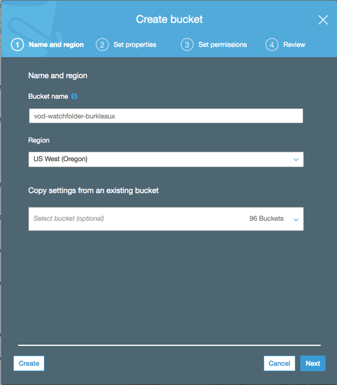
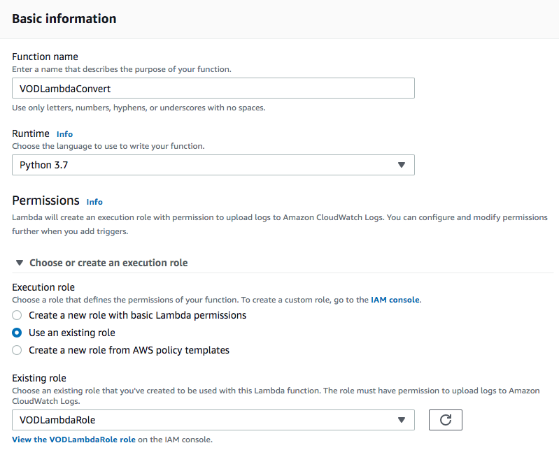
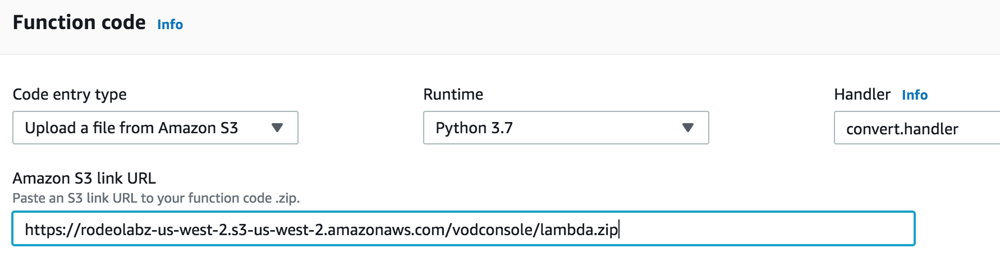
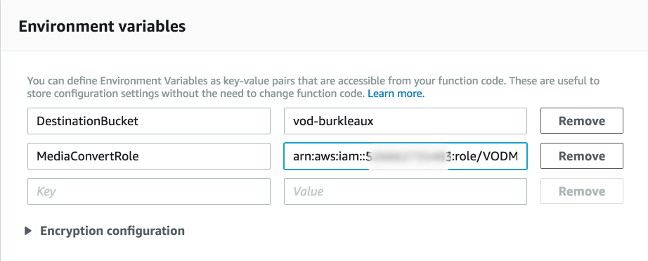
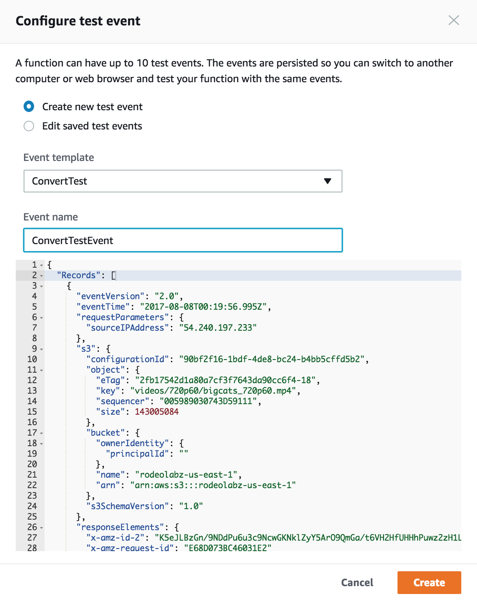
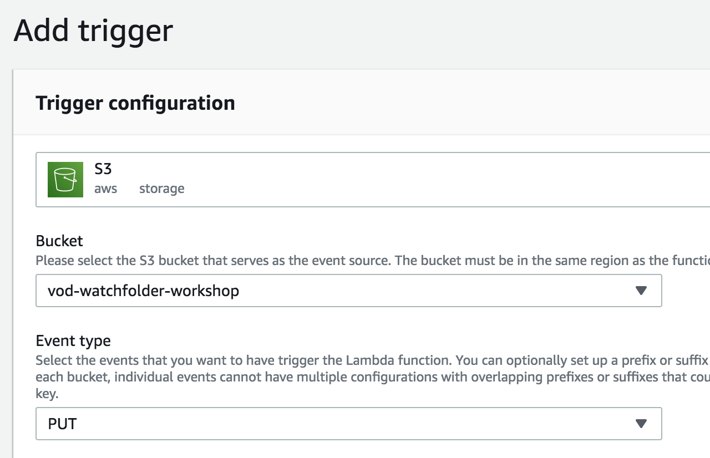
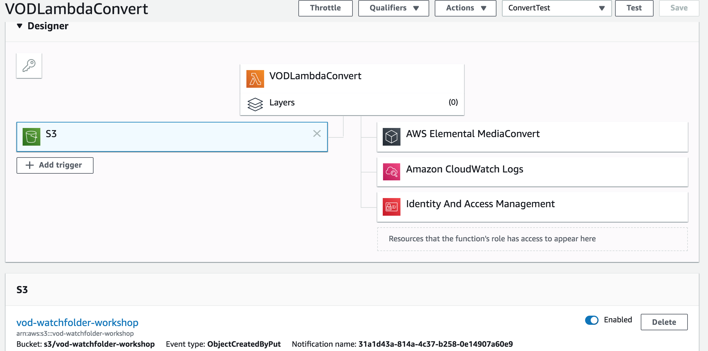
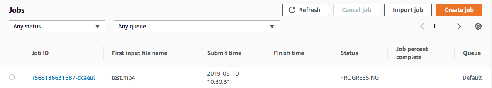
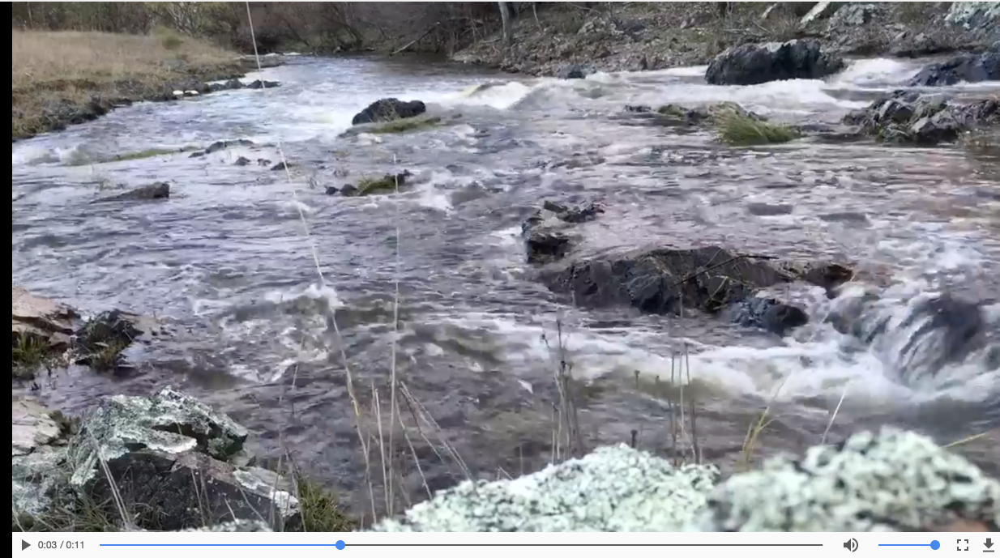

# Automating  MediaConvert Jobs with Lambda

NOTE: Please also see [Workflow-WatchfolderAndNotification](./Workflow-WatchfolderAndNotification/README.md) for a Lambda sample that includes job status notifications.

In this module, you'll use Amazon S3 events and Lambda to automatically trigger AWS Elemental MediaConvert jobs. The ability to watch S3 folders and take action on incoming items is a useful automation technique that enables the creation of fully unattended workflows. In our case, the user will place videos in a folder on AWS S3 which will trigger an ingest workflow to convert the video.  We'll use the job definition from the previous modules as the basis for our automated job.  


You'll implement a Lambda function that will be invoked each time a user uploads a video.  The lambda will send the video to the MediaConvert service to produce several outputs:

- An Apple HLS adaptive bitrate stream for playout on multiple sized devices and varying bandwidths.
- An MP4 stream
- Thumbnails for use in websites to show a preview of the video at a point in time.

Converted outputs will be saved in the S3 MediaBucket created in earlier in the lab.

## Implementation Instructions

Each of the following sections provide an implementation overview and detailed, step-by-step instructions. The overview should provide enough context for you to complete the implementation if you're already familiar with the AWS Management Console or you want to explore the services yourself without following a walkthrough.

A CloudFormation template is provided for this module in the file `WatchFolder.yaml`, if you would prefer to build the automated workflow automatically. **Note:** Run the CloudFormation template in us-west-2.

### [1. Create an Amazon S3 bucket to use for uploading videos to be converted](#watchfolder-bucket)

Use the console or AWS CLI to create an Amazon S3 bucket. Keep in mind that your bucket's name must be globally unique across all regions and customers. We recommend using a name like `vod-watchfolder-firstname-lastname`. If you get an error that your bucket name already exists, try adding additional numbers or characters until you find an unused name.

1. In the AWS Management Console choose **Services** then select **S3** under Storage.

1. Choose **+Create Bucket**

1. Provide a globally unique name for your bucket such as `vod-watchfolder-firstname-lastname`.

1. Select the Region you've chosen to use for this workshop from the dropdown.

1. Choose **Create** in the lower left of the dialog without selecting a bucket to copy settings from.

    


### [2. Create an IAM Role for Your Lambda function](#vod-lambda-role)

#### Background

Every Lambda function has an IAM role associated with it. This role defines what other AWS services the function is allowed to interact with. For the purposes of this workshop, you'll need to create an IAM role that grants your Lambda function permission to interact with the MediaConvert service and with the DynamoDB table created in the last step.  

#### High-Level Instructions

Use the IAM console to create a new role. Name it `VODLambdaRole` and select AWS Lambda for the role type. 

Attach the managed policy called `AWSLambdaBasicExecutionRole` to this role to grant the necessary CloudWatch Logs permissions. 

Use inline policies to grant permissions to other resources needed for the lambda to execute.

#### Step-by-step instructions

1. From the AWS Management Console, click on **Services** and then select **IAM** in the Security, Identity & Compliance section.

1. Select **Roles** in the left navigation bar and then choose **Create role**.

1. Select **AWS Service** and **Lambda** for the role type, then click on the **Next:Permissions** button.

    **Note:** Selecting a role type automatically creates a trust policy for your role that allows AWS services to assume this role on your behalf. If you were creating this role using the CLI, AWS CloudFormation or another mechanism, you would specify a trust policy directly.

1. Begin typing `AWSLambdaBasicExecutionRole` in the **Filter** text box and check the box next to that role.

1. Delete what you entered in the **Filter** text box, and this time search for **AmazonS3FullAccess**. Check the box next to this role. 

1. Choose **Next:Tags**.

1. Choose **Next:Review**.

1. Enter `VODLambdaRole` for the **Role name**.

1. Choose **Create role**.

1. Type `VODLambdaRole` into the filter box on the Roles page and choose the role you just created.

1. On the Permissions tab, click on the **Add Inline Policy** link and choose the **JSON** tab.

1. Copy and paste the following JSON in the **Policy Document Box**.  You will need to edit this policy in the next step to fill in the resources for your application.

```
{
    "Version": "2012-10-17",
    "Statement": [
        {
            "Action": [
                "logs:CreateLogGroup",
                "logs:CreateLogStream",
                "logs:PutLogEvents"
            ],
            "Resource": "*",
            "Effect": "Allow",
            "Sid": "Logging"
        },
        {
            "Action": [
                "iam:PassRole"
            ],
            "Resource": [
                "<ARN for vod-MediaConvertRole>"
            ],
            "Effect": "Allow",
            "Sid": "PassRole"
        },
        {
            "Action": [
                "mediaconvert:*"
            ],
            "Resource": [
                "*"
            ],
            "Effect": "Allow",
            "Sid": "MediaConvertService"
        }
    ]
}
```
1. Replace <ARN for vod-MediaConvertRole> tag in the policy with the ARN for the vod-MediaConvertRole you created earlier.
2. Click on the **Review Policy** button.

1. Enter `VODLambdaPolicy` in the **Policy Name** box.

1. Click on the **Create Policy** button.

### 3. Create a Lambda Function for converting videos

#### Background

AWS Lambda will run your code in response to events such as a putObject into S3 or an HTTP request. In this step you'll build the core function that will process videos using the MediaConvert python SDK. The lambda function will respond to putObject events in your S3 source bucket.  Whenever a video file is added, the lambda will start a MediaConvert job.

This lambda will submit a job to MediaConvert, but it won't wait for the job to complete.  In a future module you'll use cloudwatch events to automatically monitor your MediaConvert jobs and take an action when they finish.

#### High-Level Instructions

Use the AWS Lambda console to create a new Lambda function called `VODLambdaConvert` that will process the API requests. Use the provided [convert.py](convert.py) example implementation for your function code. 

Make sure to configure your function to use the `VODLambdaRole` IAM role you created in the previous section.

#### Step-by-step instructions 

1. Choose **Services** then select **Lambda** in the Compute section.

1. Choose **Create function**.

1. Choose the **Author from scratch** button.

1. On the **Author from Scratch** panel, enter `VODLambdaConvert` in the **Function name** field.
2. Select **Python 3.7** for the **Runtime**.

1. Expand the **Choose or create an execution role**.

1. Select **Use an existing role**. 

1. Select `VODLambdaRole` from the **Existing Role** dropdown.

1. Click on **Create function**.

    

1. On the Configuration tab of the VODLambdaConvert page, in the  **function code** panel:  

    1. Select **Upload a file from Amazon S3** for the **Code entry type**
    1. Enter the following for the URL: `https://rodeolabz-us-west-2.s3-us-west-2.amazonaws.com/vodconsole/lambda.zip`. 
    
        Note that this zip file is simply the [convert.py script](convert.py) and the [job JSON](job.json) file provided in this repo that you could zip up yourself, if desired.

    1. Enter `convert.handler` for the **Handler** field.

        

1. On the **Environment Variables** panel of the VODLambdaConvert page, enter the following keys and values:

    * DestinationBucket = vod-lastname (or whatever you named your bucket in module 1)
    * MediaConvertRole = arn:aws:iam::ACCOUNT NUMBER:role/vod-MediaConvertRole
    * Application = VOD

    

1. On the  **Basic Settings** panel, set **Timeout** to 2 minutes.

1. Scroll back to the top of the page and click on the **Save** button.

### Test the lambda

1. From the main edit screen for your function, select **Test**.

    

1. Enter `ConvertTest` in the **Event name** box.


1. Copy and paste the following test event into the editor:

    ```JSON
    {
      "Records": [
          {
              "eventVersion": "2.0",
              "eventTime": "2017-08-08T00:19:56.995Z",
              "requestParameters": {
                  "sourceIPAddress": "54.240.197.233"
              },
              "s3": {
                  "configurationId": "90bf2f16-1bdf-4de8-bc24-b4bb5cffd5b2",
                  "object": {
                      "eTag": "2fb17542d1a80a7cf3f7643da90cc6f4-18",
                      "key": "vodconsole/TRAILER.mp4",
                      "sequencer": "005989030743D59111",
                      "size": 143005084
                  },
                  "bucket": {
                      "ownerIdentity": {
                          "principalId": ""
                      },
                      "name": "rodeolabz-us-west-2",
                      "arn": "arn:aws:s3:::rodeolabz-us-west-2"
                  },
                  "s3SchemaVersion": "1.0"
              },
              "responseElements": {
                  "x-amz-id-2": "K5eJLBzGn/9NDdPu6u3c9NcwGKNklZyY5ArO9QmGa/t6VH2HfUHHhPuwz2zH1Lz4",
                  "x-amz-request-id": "E68D073BC46031E2"
              },
              "awsRegion": "us-west-2",
              "eventName": "ObjectCreated:CompleteMultipartUpload",
              "userIdentity": {
                  "principalId": ""
              },
              "eventSource": "aws:s3"
          }
      ]
    }
    ```
1. Click on **Create** button. 
1. Then back on the main page, click on **Test** button.
1. Verify that the execution succeeded and that the function result looks like the following:
    ```JSON
    {
    "body": "{}",
    "headers": {
        "Access-Control-Allow-Origin": "*",
        "Content-Type": "application/json"
    },
    "statusCode": 200
    }
    ```

### 6. Create a S3 PutItem Event Trigger for your Convert lambda

#### Background

In the previous step, you built a lambda function that will convert a video in response to an S3 PutItem event.  Now it's time to hook up the Lambda trigger to the watchfolder S3 bucket.

#### High-Level Instructions

Use the AWS Lambda console to add a putItem trigger from the `vod-watchfolder-firstname-lastname` S3 bucket to the `VODLambdaConvert` lambda.  

#### Step-by-step instructions

1. In the **Configuration->Designer** panel of the VODLambdaConvert function, click on **Add trigger** button. 
1. Select **S3** from the **Trigger configuration** dropdown.
1. Select `vod-watchfolder-firstname-lastname` or the name you used for the watchfolder bucket you created earlier in this module for the **Bucket**.
1. Select **PUT** for the **Event type**.

    

1. Leave the rest of the settings as the default and click the **Add** button.

    


### Test the watchfolder automation

You can use your own video or use the test.mp4 video included in this folder to test the workflow. 

In the next module of this lab, we will setup automated monitoring of jobs created using the watchfolder workflow.  Until then, you can monitor the the MediaConvert console.  

1. Open the S3 console overview page for the watchfolder S3 bucket you created earlier.
1. Select **Upload** and then choose the file [test.mp4](test.mp4) from the directory for this lab module on your computer.
1. Note the time that the upload completed.
1. Open the MediaConvert jobs page and find a job for the input 'test.mp4' that was started near the time your upload completed.  

    

1. Navigate to the MP4 or HLS output and play the test video by clicking on the test.mp4 output http resource.

    


