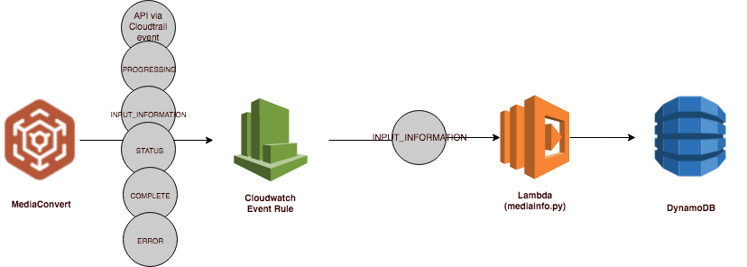
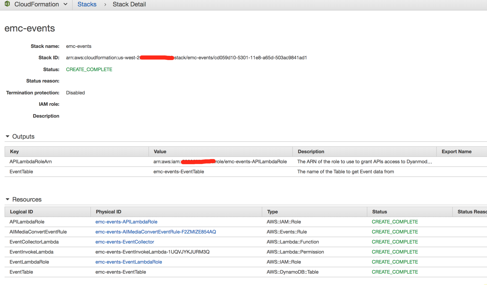
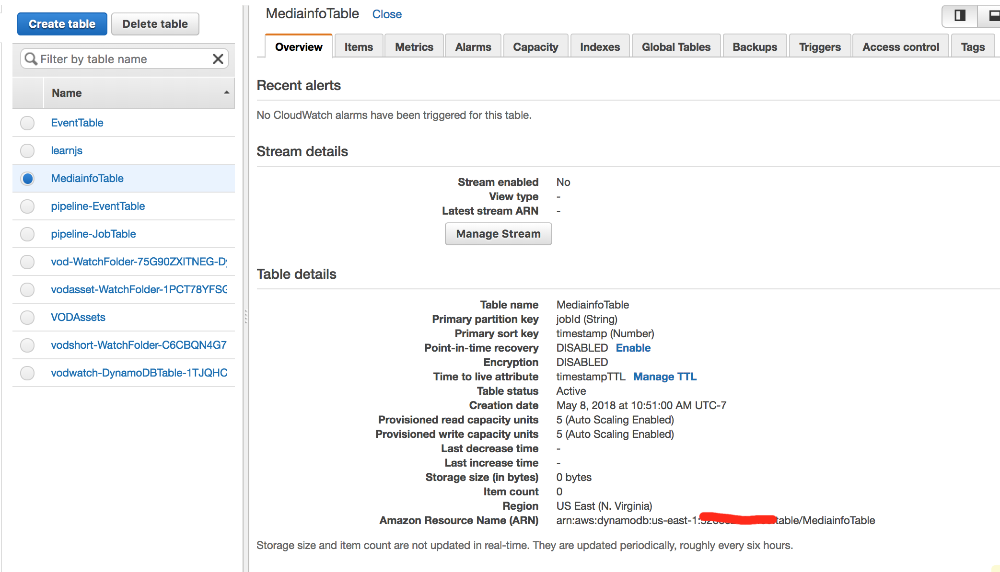
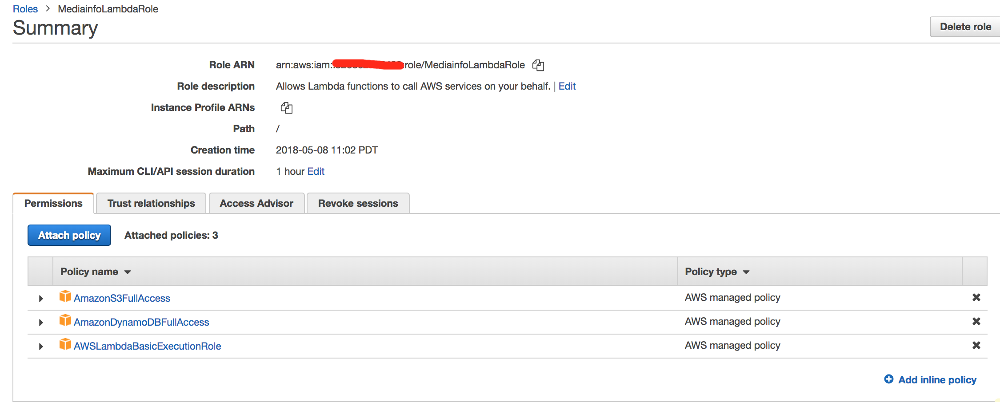
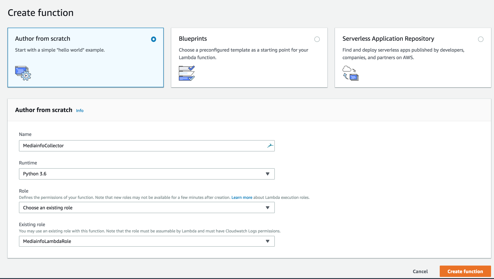
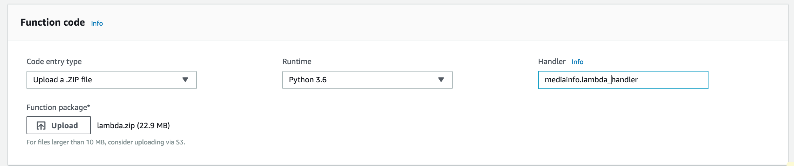
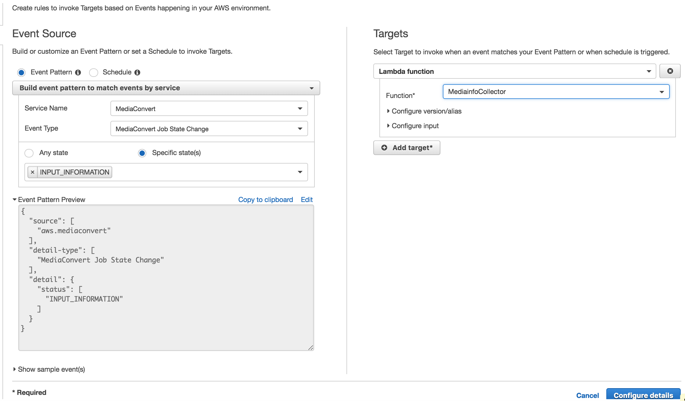
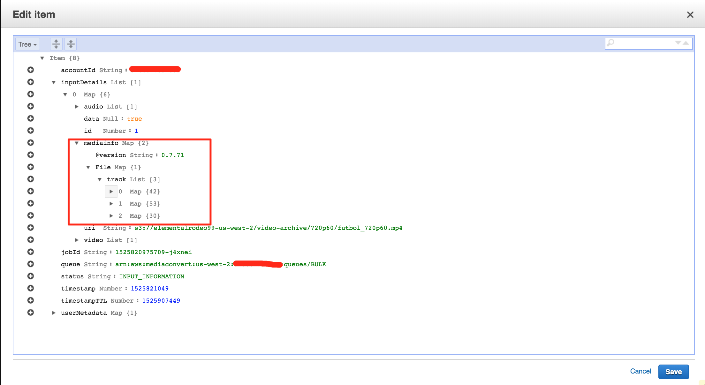

# Automatically run Mediainfo when a MediaConvert job is created

In this module you'll use Cloudwatch and Lambda to automatically collect metadata about the input video of a MediaConvert job using mediainfo.  

This tutorial is based off the AWS blog post [Extracting Video Metadata using Lambda and Mediainfo](https://aws.amazon.com/blogs/compute/extracting-video-metadata-using-lambda-and-mediainfo/)



You'll implement a Lambda function that will be invoked each time a MediaConvert INPUT_INFORMATION event is detected by CloudWatch event rules.  The lambda stores the mediainfo outputs in DynamoDB so we can examine them later.

## Prerequisites

1. You need the ability to create MediaConvert jobs for triggering the automation.  Jobs can be created from the console or you could use the watchfolder workflow from this this folder: [Workflow-WatchfolderAndNotification](./Workflow-WatchfolderAndNotification/README.md).  

## Implementation Instructions

Each of the following sections provide an implementation overview and detailed, step-by-step instructions. The overview should provide enough context for you to complete the implementation if you're already familiar with the AWS Management Console or you want to explore the services yourself without following a walkthrough.
 
### (optional) Skip ahead with CloudFormation 
A CloudFormation template is provided for this module in the file `mediainfo.yaml`, if you would prefer to build the workflow automatically. 

Region| Launch
------|-----
US East (N. Virginia) | [](https://console.aws.amazon.com/cloudformation/home?region=us-east-1#/stacks/new?stackName=emc-mediainfo&templateURL=https://s3.amazonaws.com/rodeolabz-us-east-1/vodtk/1c-mediaconvert-mediainfo/mediainfo.yaml)
US West (Oregon) | [](https://console.aws.amazon.com/cloudformation/home?region=us-west-2#/stacks/new?stackName=emc-mediainfo&templateURL=https://s3.amazonaws.com/rodeolabz-us-west-2/vodtk/1c-mediaconvert-mediainfo/mediainfo.yaml)


The information about the resources created is in the **Outputs** tab of the stack.  Save this in a browser tab so you can use it later when you create other stacks and MediaConvert jobs.



### 1. Create a DynamoDB table for storing mediainfo outputs

Use the console to create a DyanmoDB table called `MediainfoTable`. 

1. Select the Region you've chosen to use for this workshop from the dropdown.

1. In the AWS Management Console choose **Services** then select **DynamoDB** under Storage.

1. Click on the **Create Table** button

1. Provide a name for your table such as  `MediainfoTable` in the **Table name** box.
2. Type `jobId` in the **Primary key** box
3. Check the **Add sort key** radio button
4. Fill in the sort key box with `timestamp` and change the type to **Number** in the dropdown
5. Leave everything else as Default and click **Create**
7. In the **Overview** tab, select the **Manage TTL** link
8. Type in `timestampTTL` in the box and click **Continue**

    


### 2. Create an IAM Role for Your Lambda function

#### Background

Every Lambda function has an IAM role associated with it. This role defines what other AWS services the function is allowed to interact with. For the purposes of this workshop, you'll need to create an IAM role that grants your Lambda function permission to interact with the  DynamoDB table created in the last step.  

#### High-Level Instructions

Use the IAM console to create a new role. Name it `MediainfoLambdaRole` and select AWS Lambda for the role type. 

Attach the managed policy called `AWSLambdaBasicExecutionRole` to this role to grant the necessary CloudWatch Logs permissions. 

Use inline policies to grant permissions to other resources needed for the lambda to execute.

#### Step-by-step instructions

1. From the AWS Management Console, click on **Services** and then select **IAM** in the Security, Identity & Compliance section.

1. Select **Roles** in the left navigation bar and then choose **Create role**.

1. Select **AWS Service** and **Lambda** for the role type, then click on the **Next:Permissions** button.

    **Note:** Selecting a role type automatically creates a trust policy for your role that allows AWS services to assume this role on your behalf. If you were creating this role using the CLI, AWS CloudFormation or another mechanism, you would specify a trust policy directly.

1. Begin typing `AWSLambdaBasicExecutionRole` in the **Filter** text box and check the box next to that role.

1. Choose **Next:Review**.

1. Repeat the search with `AmazonDyanamoDBFullAccess` in the **Filter** text box and check the name next to that role.
1. Repeat the search with `AmazonS3FullAccess` in the **Filter** text box and check the name next to that role.

1. Enter `MediainforoLambdaRole` for the name of the role.

1. Choose **Create role**.

    


### 3. Create a Lambda Function for collecting mediainfo

#### Background

AWS Lambda will run your code in response to events. In this step you'll build the core function that will catch MediaConvert INPUT_INFORMATION events and store collect and mediainfo metadata.

This lambda is a little more complicated than the EventCollector or the WatchFolder lambdas.  We need to use resources that don't exist in the standard lambda execution environment on AWS.  These items include the mediainfo executable and some of the Python packages used in the lambda code.  In order to get these resources up to the lambda environment, we'll create a deployment package that includes all of the dependencies. 

#### High-Level Instructions

Use the AWS Lambda console to create a new Lambda function called `MediainfoCollector`. Use the provided [mediainfo.py](mediainfo.py) example implementation for your function code. 

Make sure to configure your function to use the `MediainfoLambdaRole` IAM role you created in the previous section.

#### Step-by-step instructions 

##### Create the lambda package

Option 1 (use a pre-created lambda package from s3):
    
1. There is a zipfile already created for the Cloudformation here. Copy the link and save to use when creating the lambda function later: https://rodeolabz-us-east-1.s3.amazonaws.com/vodtk/1c-mediaconvert-mediainfo/lambda.zip
    
2. Skip ahead to the next step and select **Copy a file from S3** instead of upload when you add the function code.

Option 2 - create your own lambda package
    
1. Obtain an AWS Lambda compatible copy of mediainfo.  You can download a version [here](https://s3.amazonaws.com/elementalrodeo99-us-east-1/pipeline/pipeline-base/mediainfo). 
3.  Place the copy of mediainfo in the **ElementalTechMarketingVODTools/1C-MediaConvert-mediainfo** directory
2. Setup a virtualenv environment, vodtk,  for developing in this project:

        ```
        virtualenv -p python3 <virtualenv-dir>/vodtk
        source <virtualenv-dir>/vodtk/bin/activate
        cd <git-repo>/ElementalTechMarketingVODTools/1C-MediaConvert-mediainfo
        pip install -r requirements.txt
        ```
2. Create a zipfile for the mediainfo lambda

        ```
        export VIRTUALENV='<virtualenv-dir>/vodtk'
        export ZIP_FILE='lambda.zip'
        export PYTHON_VERSION='python3.6'

        DIR=`pwd`
        cd $VIRTUALENV/lib/$PYTHON_VERSION/site-packages/
        zip -r9 $DIR/$ZIP_FILE *
        cd $DIR 
        zip -g $ZIP_FILE *
        ```

##### Create the lambda function

1. Choose **Services** then select **Lambda** in the Compute section.

1. Choose **Create function**.

1. Choose the **Author from scratch** button.

1. On the **Author from Scratch** panel, enter `MediainfoCollector` in the **Name** field.
2. Select **Python 3.6** for the **Runtime**.

1. Choose **Use and existing role** from the Role dropdown.

1. Select `MediainfoLambdaRole` from the **Existing Role** dropdown.

    

1. Click on **Create function**.

1. On the Configuration tab of the MediainfoCollector page, in the  **function code** panel:  

    1. Select **Upload a zip file** for the **Code entry type**
    2. Click **Upload** and select the zip file you created in the previous step from the dialog box. 

    1. Enter `mediainfo.handler` for the **Handler** field.

        

1. On the **Environment Variables** panel of the **MediainfoCollector** lambda console page, enter the following keys and values:

    1. MediainfoTable = MediainfoTable
    1. MediainfoTableTTL = 1 

    

1. On the  **Basic Settings** panel, enter the following: 
    
    1. Timeout = 2 min

1. Scroll back to the top of the page and click on the **Save** button.

### Test the lambda

1. From the main edit screen for your function, select the dropdown that says **_Select test event_** and then select **Configure test event**.


1. Copy and paste the following test event into the editor:

    ```JSON
    {
    "version": "0",
    "id": "dc02e4d4-5955-368e-07b6-7d561e848b5d",
    "detail-type": "MediaConvert Job State Change",
    "source": "aws.mediaconvert",
    "account": "123456789",
    "time": "2018-05-08T17:05:33Z",
    "region": "us-east-1",
    "resources": [
      "arn:aws:mediaconvert:us-east-1:123456789:jobs/1525799045060-9vh36h"
    ],
    "detail": {
      "timestamp": 1525799133520,
      "accountId": "123456789",
      "queue": "arn:aws:mediaconvert:us-east-1:123456789:queues/Default",
      "jobId": "1525799045060-9vh36h",
      "status": "INPUT_INFORMATION",
      "userMetadata": {
        "workflow": "funnycatvideos"
      },
      "inputDetails": [
        {
          "id": 1,
          "uri": "s3://elementalrodeo99-us-west-2/video-archive/720p60/futbol_720p60.mp4",
          "video": [
            {
              "streamId": 1,
              "codec": "H_264",
              "width": 1280,
              "height": 720,
              "frameRate": 60,
              "sar": "1:1",
              "bitDepth": 8,
              "interlaceMode": "PROGRESSIVE",
              "colorFormat": "YUV_420",
              "standard": "UNSPECIFIED",
              "fourCC": "avc1"
            }
          ],
          "audio": [
            {
              "streamId": 2,
              "codec": "AAC",
              "channels": 2,
              "sampleRate": 48000,
              "language": "ENG"
            }
          ],
          "data": null
        }
      ]
    },
    "timestamp": 1525799133,
    "testTime": 1525799133,
    "timestampTTL": 1525885533,
    "jobId": "1525799045060-9vh36h"
  }
    ```

1. Fill in the **Test event name** `InputInfoTest` 
2. Choose **Save and test**.

1. Verify that the execution succeeded and that the **result returned by your function execution** box has:
    ```
    true
    ```

### 2. Create Cloudwatch event rule for determining what events will invoke our lambda function

#### Background

Unlike S3, MediaConvert doesn't provide a direct Event Source Mapping type for Lambdas, so we need to create a CloudWatch event rule to invoke Lambda in response to MediaConvert INPUT_INFORMATION events.

#### High-Level Instructions

Use the AWS CloudWatch console to create a new Event Rule called `InputMediaConvertEventRule` that will trigger a Lambda when an INPUT_INFORMATION event from source `aws:mediaconvert` occurs.  

#### Step-by-step instructions 

1. Choose **Services** then select **CloudWatch** from the AWS console.

1. Click on **Rules** in the Events section of the sidebar menu.
2. Click on **Create rule**
3. Leave the **Event source** radio button activated
4. Select `MediaConvert`from the **Service name** drop down.
5. Select `Media Convert Job State Change` the **Event type** drop down 
6. Select the **Specfic state** radio button and select `INPUT_INFORMATION` from the drop down.
6. Click on **+Add target**
7. In the target dropdown, select the Lambda function you created in the last step.
8. Click on the **Configure details** button at the bottom of the page.
9. Enter `InputMediaConvertEventRule` for the **Name**
10. Click on the **Create rule** button

    

### 2. Create a role to grant Cloudwatch Event rules permission to invoke the lambda function

#### Background

Cloudwatch will need to invoke our lambda when it sees an event that matches the event rule.    

#### High-Level Instructions

Use the IAM console to create a new role. Name it `EventInvokeLambda` and select **Cloudwatch Events** as the service that will use the role.  

If you already created this role from the previous module, you can skip this step.

#### Step-by-step instructions

1. From the AWS Management Console, click on **Services** and then select **IAM** in the Security, Identity & Compliance section.

1. Select **Roles** in the left navigation bar and then choose **Create role**.

1. Select **AWS Service** and **CloudWatch Events** for the service that will use the role, and **CloudWatch Events** for the use case, then click on the **Next:Permissions** button.

    **Note:** Selecting a role type automatically creates a trust policy for your role that allows AWS services to assume this role on your behalf. If you were creating this role using the CLI, AWS CloudFormation or another mechanism, you would specify a trust policy directly.

1. The required policies will already be selected.

1. Choose **Next:Review**.

1. Enter `EventInvokeLambda` for the **Role name**.

1. Choose **Create role**.

### 2. Finally test the workflow  

#### High-Level Instructions

Create a MediaConvert job and view the events from the DynamoDB console.

#### Step-by-step instructions

1. Create a MediaConvert job using the MediaConvert console or the watchfolder workflow.
2. In one browser tab, monitor the MediaConvert console to see the progress of the job.
3. In another tab, open the DyanamoDB console and open the page for your MediainfoTable.
4. You should see one item added to the table table as the MediaConvert job progresses.
5. The mediainfo output is stored under the inputDetails for each input.

    


