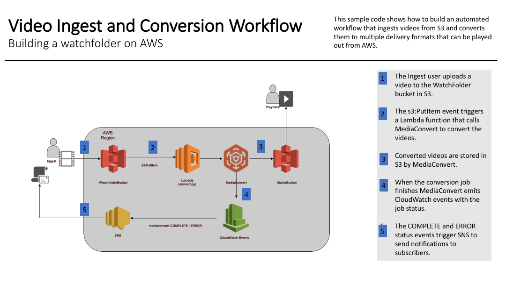
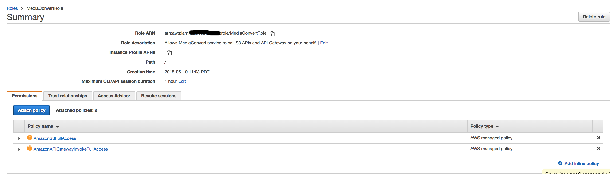
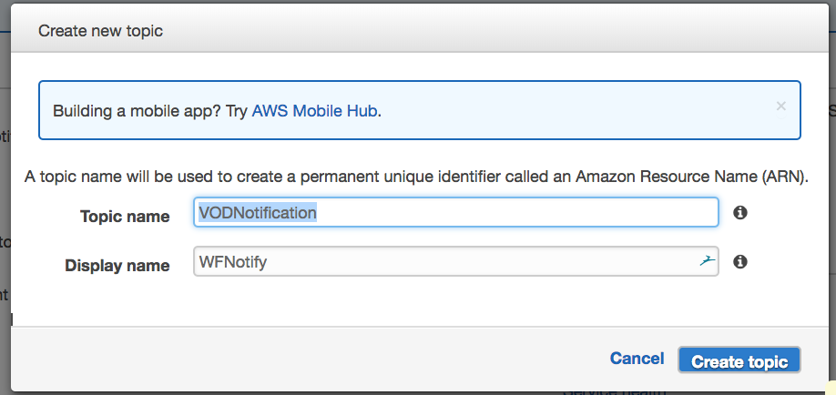
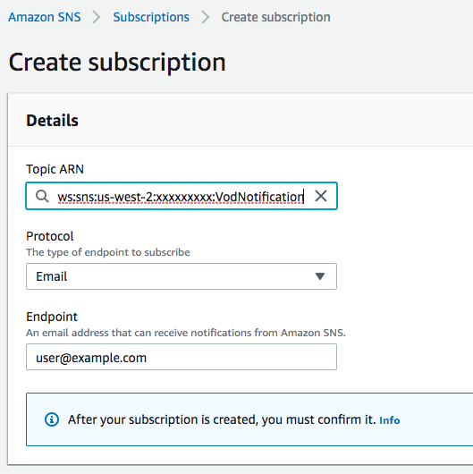
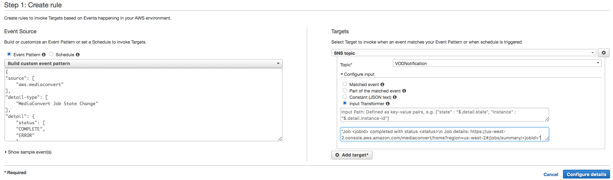
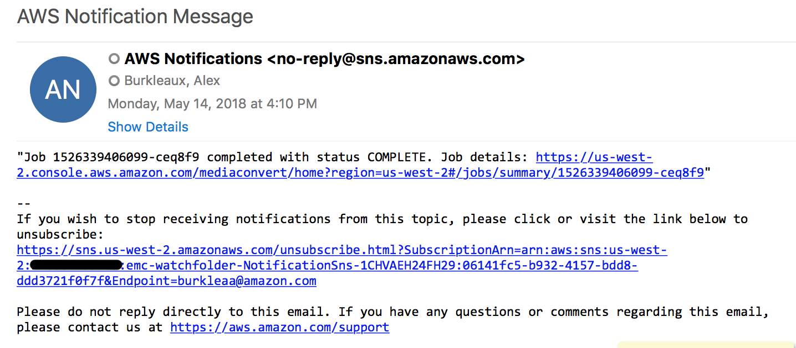

# Tutorial: Automatically trigger MediaConvert jobs on S3 objects and get notifications when the jobs finish

A watchfolder is a common method for automating video ingest and delivery workflows.  Users with video ready for delivery upload their files to a known storage location.  The upload automatically triggers an ingest workflow that converts the video to formats suitable for delivery and stores them in the cloud for on-demand viewing.   The Serverless Video Conversion Watchfolder Workflow solves this problem by using [Amazon S3](https://aws.amazon.com/s3), [AWS Lambda](https://aws.amazon.com/lambda/), [AWS MediaConvert](https://aws.amazon.com/mediaconvert/), [Amazon CloudWatch Events](https://aws.amazon.com/cloudwatch) and [Amazon Simple Notification Service](https://aws.amazon.com/sns).

The workflow will create the following outputs for each video uploaded to the WatchFolder S3 bucket /inputs folder:
- An Apple HLS adaptive bitrate stream for playout on multiple sized devices and varying bandwiths.
- An MP4 stream
- Thumbnail images collected at intervals

This tutorial lets you learn about the workflow in-depth by creating the lambda and related resources in the AWS console.  There is a companion [AWS CloudFormation](https://aws.amazon.com/cloudformation/) template for creating the lambda function and related resources automatically.  To run the automated template, follow the instructions in [README.md](./README.md).  

To see some of the other powerful broadcast grade encoding features of AWS Elemental MediaConvert check out the getting started page [here](https://aws.amazon.com/mediaconvert/)



## Prerequisites

None.

## Implementation Instructions

Each of the following sections provide an implementation overview and detailed, step-by-step instructions. The overview should provide enough context for you to complete the implementation if you're already familiar with the AWS Management Console or you want to explore the services yourself without following a walkthrough.

# PART 1: Automatically trigger MediaConvert jobs

## 1. Create an Amazon S3 bucket to use for uploading videos to be converted

Use the console or AWS CLI to create an Amazon S3 bucket. Keep in mind that your bucket's name must be globally unique across all regions and customers. We recommend using a name like `vod-watchfolder-firstname-lastname`. If you get an error that your bucket name already exists, try adding additional numbers or characters until you find an unused name.

1. In the AWS Management Console choose **Services** then select **S3** under Storage.

1. Choose **+Create Bucket**

1. Provide a globally unique name for your bucket such as `vod-watchfolder-firstname-lastname`.

1. Select the Region you've chosen to use for this workshop from the dropdown.

1. Choose **Create** in the lower left of the dialog without selecting a bucket to copy settings from.

    

## 1. Create an Amazon S3 bucket to use for storing converted video outputs from MediaConvert

In this section, you will use the AWS console to create an S3 bucket to store video and image outputs from MediaConvert.  Later, the resulting videos and images will be played out using the S3 https resource using several different players both inside and outside of the the amazonaws domain.  

In order to facilitate https access from anonymous sources inside and outside the amazonaws domain, such as video players on the internet, you will add the following settings to the S3 bucket:

* a bucket policy that enables public read   
* a policy for Cross Origin Resource Sharing (CORS) 

#### Detailed instructions 

1. In the AWS Management Console choose **Services** then select **S3** under Storage.

1. Choose **+Create Bucket**.

1. Provide a globally unique name for your bucket such as `vod-mediabucket`.

1. Select the Region you've chosen to use for this workshop from the dropdown.

1. Choose **Create** in the lower left of the dialog without selecting a bucket to copy settings from.

1. From the S3 console select the bucket you just created and go to the Overview page.

1. Select the **Properties** tab and click on the **Static website hosting** tile.  

1. Select the **Use this bucket to host a website** box.

1. Enter `index.html` in the **Index document** box.

1. Select **Save**.

1. Select the **Permissions** tab.

1. Select **Bucket policy** and paste the following JSON into the bucket policy editor.

1. Replace the text **YOUR-BUCKETNAME** with the name of the bucket you created earlier in this module.

    ```
    {
    "Version": "2012-10-17",
    "Statement": [
        {
            "Sid": "AddPerm",
            "Effect": "Allow",
            "Principal": "*",
            "Action": "s3:GetObject",
            "Resource": "arn:aws:s3:::YOUR-BUCKETNAME/*"
        }
    ]
    }
    ```
1. Click on **Save**

1. Next, click on **CORS configruation** and replace the default XML with the following XML in the **CORS configuration editor**.
    ```
    <?xml version="1.0" encoding="UTF-8"?>
    <CORSConfiguration xmlns="http://s3.amazonaws.com/doc/2006-03-01/">
    <CORSRule>
        <AllowedOrigin>*</AllowedOrigin>
        <AllowedMethod>GET</AllowedMethod>
        <MaxAgeSeconds>3000</MaxAgeSeconds>
        <AllowedHeader>*</AllowedHeader>
    </CORSRule>
    </CORSConfiguration>
    ```
1. Click on the **Save** button

## 3. Create an IAM Role to Pass to MediaConvert

#### Background

MediaConvert will will need to be granted permissions to read and write files from your S3 buckets and generate CloudWatch events as it processes videos.  MediaConvert is granted the permissions it needs by assuming a role that is passed to it along with trancoding jobs. 

#### High-Level Instructions

Use the IAM console to create a new role. Name it `MediaConvertRole` and select AWS Lambda for the role type. Use inline policies to grant permissions to other resources needed for the lambda to execute.

#### Step-by-step instructions 

1. From the AWS Management Console, click on **Services** and then select **IAM** in the Security, Identity & Compliance section.

1. Select **Roles** in the left navigation bar and then choose **Create role**.

1. Select **AWS Service** and **MediaConvert** for the role type, choose **MediaConvert** as the use case, then click on the **Next:Permissions** button.

    **Note:** Selecting a role type automatically creates a trust policy for your role that allows AWS services to assume this role on your behalf. If you were creating this role using the CLI, AWS CloudFormation or another mechanism, you would specify a trust policy directly.

1. Choose **Next:Review**.

1. Enter `MediaConvertRole` for the **Role name**.

1. Choose **Create role**.


1. Type `MediaConvertRole` into the filter box on the Roles page and choose the role you just created.  Your role should look like this.

    

1. Save the ARN for use later

## 2. Create an IAM Role for Your Lambda function

#### Background

Every Lambda function has an IAM role associated with it. This role defines what other AWS services the function is allowed to interact with. For the purposes of this workshop, you'll need to create an IAM role that grants your Lambda function permission to interact with the MediaConvert service.  

#### High-Level Instructions

Use the IAM console to create a role. Name it `VODLambdaRole` and select AWS Lambda for the role type. 

Attach the managed policy called `AWSLambdaBasicExecutionRole` to this role to grant the necessary CloudWatch Logs permissions. 

Use inline policies to grant permissions to other resources needed for the lambda to execute.

#### Step-by-step instructions

1. From the AWS Management Console, click on **Services** and then select **IAM** in the Security, Identity & Compliance section.

1. Select **Roles** in the left navigation bar and then choose **Create role**.

1. Select **AWS Service** and **Lambda** for the role type, then click on the **Next:Permissions** button.

    **Note:** Selecting a role type automatically creates a trust policy for your role that allows AWS services to assume this role on your behalf. If you were creating this role using the CLI, AWS CloudFormation or another mechanism, you would specify a trust policy directly.

1. Begin typing `AWSLambdaBasicExecutionRole` in the **Filter** text box and check the box next to that role.

1. Choose **Next:Review**.

1. Enter `VODLambdaRole` for the **Role name**.

1. Choose **Create role**.

1. Type `VODLambdaRole` into the filter box on the Roles page and choose the role you just created.

1. On the Permissions tab, expand the **Add Inline Policies** section and choose the **JSON** tab.

1. Copy and paste the following JSON in the **Policy Document Box**.  You will need to edit this policy in the next step to fill in the resources for your application.

```
{
    "Version": "2012-10-17",
    "Statement": [
        {
            "Action": [
                "logs:CreateLogGroup",
                "logs:CreateLogStream",
                "logs:PutLogEvents"
            ],
            "Resource": "*",
            "Effect": "Allow",
            "Sid": "Logging"
        },
        {
            "Action": [
                "iam:PassRole"
            ],
            "Resource": [
                "ARNforMediaConvertRole"
            ],
            "Effect": "Allow",
            "Sid": "PassRole"
        },
        {
            "Action": [
                "mediaconvert:*"
            ],
            "Resource": [
                "*"
            ],
            "Effect": "Allow",
            "Sid": "MediaConvertService"
        },
        {
            "Action": [
                "s3:*"
            ],
            "Resource": [
                "*"
            ],
            "Effect": "Allow",
            "Sid": "S3Service"
        }
    ]
}
```
1. Replace the ARNforMediaConvertRole tag in the policy with the ARN for the VODMMediaConvertRole you created earlier.

2. Click on the **Review Policy** button.

1. Enter `VODLambdaPolicy` in the **Policy Name** box.

1. Click on the **Create Policy** button.

## 3. Create a lambda Function for converting videos

#### Background

AWS Lambda will run your code in response to events such as a putObject into S3 or an HTTP request. In this step you'll build the core function that will process videos using the MediaConvert python SDK. The lambda function will respond to putObject events in your S3 WatchFolder bucket.  Whenever a video file is added to the /inputs folder, the lambda will start a MediaConvert job.

This lambda will submit a job to MediaConvert, but it won't wait for the job to complete.  In PART 2 of this tutorial, you'll use CloudWatch events to automatically monitor your MediaConvert jobs and notify you when they finish.

#### High-Level Instructions

Use the AWS Lambda console to create a new Lambda function called `VODLambdaConvert` that will process the API requests. Use the provided [convert.py](convert.py) example implementation for your function code. 

Make sure to configure your function to use the `VODLambdaRole` IAM role you created in the previous section.

#### Step-by-step instructions 

1. Choose **Services** then select **Lambda** in the Compute section.

1. Choose **Create a Lambda function**.

1. Choose the **Author from scratch** button.

1. On the **Author from Scratch** panel, enter `VODLambdaConvert` in the **Name** field.
2. Select **Python 2.7** for the **Runtime**.

1. Choose **Use and existing role** from the Role dropdown.

1. Select `VODLambdaRole` from the **Existing Role** dropdown.

1. Click on **Create function**.

    

1. Create a zip file containing the lambda code and JSON job settings.  In a terminal, navigate to the directory where you cloned this git repository and zip the code for the lambda.

    ```
    cd ElementalTechMarketingVODTools/1A-MediaConvert-watchfolder
    zip -r lambda.zip convert.py job.json
    ```

1. On the Configuration tab of the VODLambdaConvert page, in the  **function code** panel:  

    1. Select **Upload a zip file** for the **Code entry type**
    2. Click **Upload** and select the zip file you created in the previous step from the dialog box. 

    1. Enter `convert.handler` for the **Handler** field.

        

1. On the **Environment Variables** panel of the VODLambdaConvert page, enter the following keys and values:

    1. DestinationBucket = vod-mediabucket-firstname-lastname (or whatever you named your S3 MediaBucket bucket)
    1. MediaConvertRole = arn:aws:iam::ACCOUNT NUMBER:role/MediaConvertRole (or whatever you named your role to pass to MediaConvert)
    2. Application = VOD

      

1. On the  **Basic Settings** panel, enter the following: 
    
    1. Timeout = 2 min

1. Scroll back to the top of the page and click on the **Save** button.

## Test the lambda

1. From the main console screen for your function, select the dropdown that says **_Select a test event..._**  and choose **Configure test event**.

1. Copy and paste the following test event into the editor:

    ```JSON
    {
    "Records": [
      {
        "eventVersion": "2.0",
        "eventTime": "2017-08-08T00:19:56.995Z",
        "requestParameters": {
          "sourceIPAddress": "54.240.197.233"
        },
        "s3": {
          "configurationId":   "90bf2f16-1bdf-4de8-bc24-b4bb5cffd5b2",
        "object": {
        "eTag": "2fb17542d1a80a7cf3f7643da90cc6f4-18",
            "key": "vodconsole/TRAILER.mp4",
            "sequencer": "005989030743D59111",
            "size": 143005084
          },
          "bucket": {
            "ownerIdentity": {
              "principalId": ""
            },
            "name": "rodeolabz-us-west-2",
            "arn": "arn:aws:s3:::rodeolabz-us-west-2"
          },
          "s3SchemaVersion": "1.0"
        },
        "responseElements": {
          "x-amz-id-2": "K5eJLBzGn/9NDdPu6u3c9NcwGKNklZyY5ArO9QmGa/t6VH2HfUHHhPuwz2zH1Lz4",
          "x-amz-request-id": "E68D073BC46031E2"
        },
        "awsRegion": "us-west-2",
        "eventName": "ObjectCreated:CompleteMultipartUpload",
        "userIdentity": {
          "principalId": ""
        },
        "eventSource": "aws:s3"
      }
    ]
    }
    ```

1. Enter `ConvertTest` in the **Event name** box
2. Choose **Save and test** to run the test.

1. Verify that the execution succeeded and that the function result looks like the following:
```JSON
{
  "body": "{}",
  "headers": {
    "Access-Control-Allow-Origin": "*",
    "Content-Type": "application/json"
  },
  "statusCode": 200
}
```

## 6. Create a S3 Event Trigger for your Convert lambda

#### Background

In the previous step, you built a lambda function that will convert a video in response to an S3 PutItem event.  Now it's time to hook up the Lambda trigger to the watchfolder S3 bucket.  We want to run the lambda whenever someone uploads a new object to the S3 bucket, so we will use PutItem operations as our Lambda trigger.

Note: S3 supports Lambda triggers directly, so we configure the Lambda trigger in S3.  Other services may emit events, but don't have a direct trigger.  In this case, we would use CloudWatch Rules as the event source rather than the service that emitted the event.

#### High-Level Instructions

Use the AWS Lambda console to add a putItem trigger from the `vod-watchfolder-firstname-lastname` S3 bucket to the `VODLambdaConvert` lambda.  

#### Step-by-step instructions

1. In the **Configuration->Designer** panel of the VODLambdaConvert function:
    1. Click on **S3* under **Add triggers**

    

1. Scroll down to the **Configure triggers** panel:
  
    1. Select `vod-watchfolder-firstname-lastname` or the name you used for the watchfolder bucket you created earlier in this module for the **Bucket**.
    2. Select **PUT** for the **Event type**.
    3. Enter `inputs/` for the **Prefix**
    3. Leave the rest of the settings as the default and click the **Add** button.

        


## Test the watchfolder automation

You can use your own video or use the test.mp4 video included in this folder to test the workflow. 

In the next module of this lab, we will setup automated monitoring of jobs created using the watchfolder workflow.  Until then, you can monitor the the MediaConvert console.  

1. Open the S3 console overview page for the watchfolder S3 bucket you created earlier.

2. Select the **Create folder** button and name it `inputs`, then click on **Save**.

3. Open the **inputs** folder by clicking on the link.

1. Select **Upload** and then choose the file `test.mp4` from the directory for this lab module on your computer.

1. Click on the **Upload** button.

2. Note the time that the upload completed.

1. Open the MediaConvert jobs page and find a job for the input 'test.mp4' that was started near the time your upload completed.  

    

1. Click on the jobId link to open the job details page.

2. Click on the link for the MP4 or HLS output (depending on what is supported by your browser).  This will take you to the S3 folder where your output is located.

3. Click on the ouput object link.

4. Play the test video by clicking on the S3 object http resource listed under the **Link** label.

    


# PART 2: Setup notifications when MediaConvert jobs finish

Manually checking the status of jobs in the MediaConvert console is great for ad-hoc workflows and for testing, but it would be more convenient to be notified automatically when the video conversion jobs finish.  In this part of the tutorial, we'll use CloudWatch Events and SNS to send e-mail notifications when jobs finish.

## 1. Create an SNS Topic for workflow status notifications

#### Background

SNS Topics allow producers to publish information and consumers to subscribe to the topic to recieve updates. We'll create a topic that we can put messages about the progress of MediaConvert jobs triggered by this workflow.

#### High-Level Instructions

Create an SNS topic called `VODNotification` that uses the Email protocol to send updates to subscribers.

#### Step-by-step instructions

1. Go to the SNS service console.
2. Click on **Create topic**
3. Enter `VODNotification` for the **Topic name**.
4. Enter `WFNotify` for the **Display name**.
5. Cick on **Create topic**

    

6. Click on **Create subscription**.
7. Select `Email` from the **Protocol** drop-down.
8. Enter the email address you want to use to recieve notification in the **Endpoint** box.
9. Click on **Create subscription** button.
10. Check the e-mail box you specified above for a confirmation e-mail.  Click on the link to confirm the subscription.

    

## 2. Create a CloudWatch Event Rule to monitor the status of MediaConvert jobs

#### Background

Cloudwatch event rules create a mapping between event patterns and target actions.  We'll create a notification rule that matches MediaConvert COMPLETE and ERROR events created from this workflow. The rule uses userMetadata.application JSON values that are set when a MediaConvert job is created to identify jobs from this workflow. We are using the name of the stack as the value of the userMetadata.application (see code in [convert.py](./convert.py)). The target of the rule is the NotificationSns SNS Topic. An InputTransformer is applied by the rule to format the information in the event before it passes on the messages to the target.

#### Step-by-step instructions

1. Open the CloudWatch console page and select the **Rules** link on the side-bar menu under Events.

2. Click on the **Create rule** button.

3. Click on the **Edit** link in the **Event pattern preview** panel.

4. Enter the following JSON in the box.

    ```
    {
    "source": [
        "aws.mediaconvert"
    ],
    "detail-type": [
        "MediaConvert Job State Change"
    ],
    "detail": {
        "status": [
        "COMPLETE",
        "ERROR"
        ],
    "userMetadata": {
        "application": [
            "VOD"
        ]
        }
    }
    }
    ```
4. Click **Save**.

5. Click on the **Add target** button in the **Targets** panel.

6. Select **SNS Topic** from the dropdown

7. Select the topic you created earlier, `VODNotification`.

8. Click on the carrot to expand the **Configure input** form.

9. Click on the **Input Transformer** radio button

10. Enter the following JSON in the **Input paths** box.

    ```
    {"jobId":"$.detail.jobId","settings":"$.detail.userMetadata.input","application":"$.detail.userMetadata.application","status":"$.detail.status"}
    ```

11. Enter the following string in the **Input Template** box:

    ```
    "Job <jobId> finished with status <status>. Job details: https://<region>.console.aws.amazon.com/mediaconvert/home?region=<region>#/jobs/summary/<jobId>"
    ```

12. Click the **Configure details** button to go to the next page.

    
13. Enter `VODNotifyEventRule` in the **Name** box and click on **Create rule**

## 3. Add a policy to allow CloudWatch rules to add to the SNS Topic

#### Background

When the VODNotifyEventRule matches a COMPLETE or ERROR event from MediaConvert, it needs to publish the transformed event to SNS.  This SNS Topic Policy gives permission to CloudWatch Events service to publish SNS notifications in this account.

#### Step-by-step instructions

1. Open the SNS console.

2. Find the policy you created earlier, VODNotification, and click on the link to go to the detail page.

3. Select **Edit topic policy** on the **Other topic actions** drop-down menu.

4. On the **Advanced view** tab, edit the policy JSON by adding the following statement.  
    1. Replace the ARN with the ARN for this Topic.
        1. Add this JSON fragment to the begining of the list object.  Right after the line that says **"Statement": [**.

    ```
    {
      "Sid": "TrustCWEToPublishEventsToMyTopic",
      "Effect": "Allow",
      "Principal": {
        "Service": "events.amazonaws.com"
      },
      "Action": "sns:Publish",
      "Resource": "ARN"
    },
    ```
4. Click on **Update policy**

5. The new policy should look like this:

    ```
    {
    "Version": "2008-10-17",
    "Id": "__default_policy_ID",
    "Statement": [
        {
        "Sid": "TrustCWEToPublishEventsToMyTopic",
        "Effect": "Allow",
        "Principal": {
            "Service": "events.amazonaws.com"
        },
        "Action": "sns:Publish",
        "Resource": "ARN"
        },
        {
        "Sid": "__default_statement_ID",
        "Effect": "Allow",
        "Principal": {
            "AWS": "*"
        },
        "Action": [
            "SNS:Publish",
            "SNS:RemovePermission",
            "SNS:SetTopicAttributes",
            "SNS:DeleteTopic",
            "SNS:ListSubscriptionsByTopic",
            "SNS:GetTopicAttributes",
            "SNS:Receive",
            "SNS:AddPermission",
            "SNS:Subscribe"
        ],
        "Resource": "arn:aws:sns:us-west-2:ACCOUNT:vod-notification",
        "Condition": {
            "StringEquals": {
            "AWS:SourceOwner": "ACCOUNT"
            }
        }
        },
        {
        "Sid": "__console_sub_0",
        "Effect": "Allow",
        "Principal": {
            "AWS": "*"
        },
        "Action": [
            "SNS:Subscribe",
            "SNS:Receive"
        ],
        "Resource": "arn:aws:sns:us-west-2:ACCOUNT:vod-notification"
        }
        
    ]
    }
    ```


## Test notifications

1. Go to the S3 console and open the detail page for the WatchFolder bucket you created earlier.  
2. Open the inputs/ folder.
3. Delete the test video you uploaded earlier.
4. Upload test.mp4 again
5. Repeat the verification steps you did for PART 1.
5. When the job finished, check the email you used to setup the workflow.  You should have a message similar to this:

    

