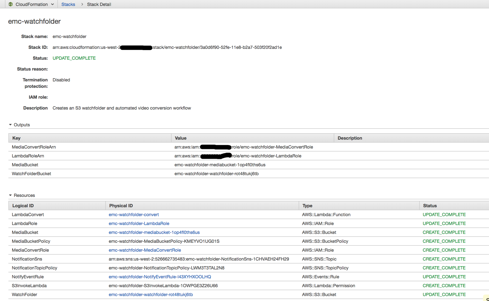

# Serverless Video Conversion Watchfolder Workflow 
## Automatically trigger MediaConvert jobs on S3 objects and get notification when the jobs complete

Video delivery workflows use MediaConvert to transcode source videos into formats that ensure high quality playback on all of the devices and platforms needed to reach target viewers.  A watchfolder is a common method for automating video ingest and delivery workflows. Users with video ready for delivery upload their files to a known storage location.  The upload automatically triggers an ingest workflow that converts the video to formats suitable for delivery and stores them in the cloud for on-demand viewing.   The Serverless Video Conversion Watchfolder Workflow solves this problem by using [Amazon S3](https://aws.amazon.com/s3), [AWS Lambda](https://aws.amazon.com/lambda/), [AWS MediaConvert](https://aws.amazon.com/mediaconvert/), [Amazon CloudWatch Events](https://aws.amazon.com/cloudwatch) and [Amazon Simple Notification Service](https://aws.amazon.com/sns).

The workflow will create the following outputs for each video uploaded to the WatchFolder S3 bucket /input folder:
- An Apple HLS adaptive bitrate stream for playout on multiple sized devices and varying bandwiths.
- An MP4 stream
- Thumbnail images collected at intervals

This repository contains sample code for the Lambda function depicted in the diagram below as well as an [AWS CloudFormation](https://aws.amazon.com/cloudformation/) template for creating the function and related resources.

There is a companion tutorial in [README-tutorial.md](./README-tutorial.md) for creating this workflow using the AWS console.  Use the tutorial to go in depth on how the workflow is built and configured.

To see some of the other powerful broadcast grade encoding features of AWS Elemental MediaConvert check out the getting started page [here](https://aws.amazon.com/mediaconvert/)

## Adapting this workflow to use different encoding settings

It's easy to create outputs with other formats supported by MediaConvert.  MediaConvert job settings can be placed in JSON files in the WatchFolder S3 bucket /jobs folder.  The workflow will run a job for each settings file.  If no setting are specified, then the Default job included in this project will run.

## Walkthrough of the Workflow
1. The Ingest user uploads a video to the WatchFolder bucket /input folder in S3.  Only files added to the /input folder will trigger the workflow.

2. The s3:PutItem event triggers a Lambda function that calls MediaConvert to convert the videos.

3. Converted videos are stored in S3 by MediaConvert.

4. When the conversion job finishes MediaConvert emits aws:mediaconvert _Job State Change Event_ type CloudWatch events with the job status.

5. The COMPLETE and ERROR status events trigger SNS to send notifications to subscribers.

## Running the Example

### Launching the Stack on AWS

The backend infrastructure can be deployed in US West - Oregon (us-west-2) using the provided CloudFormation template.
Click **Launch Stack** to launch the template in the US West - Oregon (us-west-2) region in your account:

A CloudFormation template is provided for this module in the file `WatchFolder.yaml` to build the workflow automatically. Click **Launch Stack** to launch the template in your account in the region of your choice : 

Region| Launch
------|-----
US East (N. Virginia) | 
US West (Oregon) | 

1. Make sure to enter an e-mail address to use for workflow notifications in the workflow input form.

(On the last page of the wizard, make sure to:

2. Click the checkboxes to give AWS CloudFormation permission to **"create IAM resources"** and **"create IAM resources with custom names"**
1. Click **"Execute"**
)

The information about the resources created is in the **Outputs** tab of the stack.  Save this in a browser tab so you can use it later when you create other stacks and MediaConvert jobs.

## Testing the Example
  
You can use your own video or use the test.mp4 video included in this folder to test the workflow. 

In the next module of this lab, we will setup automated monitoring of jobs created using the watchfolder workflow.  Until then, you can monitor the the MediaConvert console.  

1. Open the S3 console overview page for the watchfolder S3 bucket you created earlier.
1. Select **Upload** and then choose the file `test.mp4` from the directory for this lab module on your computer.
1. Note the time that the upload completed.
1. Open the MediaConvert jobs page and find a job for the input 'test.mp4' that was started near the time your upload completed.  

    

1. Click on the jobId link to open the job details page.
2. Click on the link for the MP4 or HLS output (depending on what is supported by your browser).  This will take you to the S3 folder where your output is located.
3. Click on the ouput object link.
4. Play the test video by clicking on the S3 object http resource listed under the **Link** label.

    

5. Check the email you used to setup the workflow.  You should have a message similar to this:

    

## Cleaning Up the Stack Resources

To remove all resources created by this example, do the following:

1. Delete the video files in the WatchFolder and MediaBucket S3 buckets.
2. Delete the CloudFormation stack.
1. Delete the CloudWatch log groups associated with each Lambda function created by the CloudFormation stack.

## CloudFormation Template Resources
The following sections explain all of the resources created by the CloudFormation template provided with this example.

### CloudWatch Events
  
- **NotifyEventRule** - Notification rule that matches MediaConvert COMPLETE and ERROR events created from this workflow.  The rule uses userMetadata.application JSON values that are set when a MediaConvert job is created to identify jobs from this workflow.  We are using the name of the stack as the value of the userMetadata.application (see code in [convert.py](./convert.py)).  The target of the rule is the NotificationSns SNS Topic.  An InputTransformer is applied by the rule to format the information in the event before it passes on the messages to the target.

### IAM
- **MediaConvertRole** - A role that is passed to MediaConvert Python SDK via the API.  MediaConvert used this role to obtain access the the account resources needed to complete a conversion job.

- **LambdaRole** - an IAM role with policies to allow LambdaConvert to invoke the MediaConvert service, pass the MediaConvert role and access the WatchFolder bucket to look for user defined job inputs.

### Lambda
- **S3InvokeLambda** - a Lambda Permission that gives S3 permission to invoke the MediaConvert lambda. 

- **LambdaConvert** - a Lambda function that gets a video from the s3:putItem event and runs MediaConverts jobs from JSON settings in the Watchfolder/input folder.

### S3

- **WatchFolder** - S3 bucket used to store inputs to the conversion workflow.  The NotificationConfiguration sets up the lambda trigger.  The bucket is set to expire objects that are more than 7 days old.  This setting is useful for testing, but can be removed, if needed.

- **MediaBucket** - S3 bucket used to store outputs of the conversion workflow.  Cross Origin Resource sharing is enabled to allow the videos to be played out from websites and browsers.  The bucket is set to expire objects that are more than 7 days old.  This setting is useful for testing, but can be removed, if needed.

- **MediaBucketPolicy** - Sets policy for MediaBucket to public read for testing.

### SNS
  
- **NotificationTopicPolicy** - an SNS Topic Policy that give permission to CloudWatch events service to invoke SNS notifications in this account.

- **NotificationSns** - an SNS Topic for publishing notifications about the status of finished jobs from our workflow.   

## Additional resources

[AWS Video On Demand with MediaConvert Workshop](https://github.com/aws-samples/aws-media-services-simple-vod-workflow/blob/master/README.md) - use the MediaConvert console to develop video conversion jobs for adaptive bitrate and file-based delivery.  Includes adding captions, clipping and stitching and watermarking.

[Video on Demand on AWS](https://aws.amazon.com/answers/media-entertainment/video-on-demand-on-aws/) - a well-architected reference architecture that you can use to get started on production workflows.  Video on Demand on AWS has a similar workflow to this sample, but adds Step Functions to orchestrate the workflow, a Cloudfront distribution to deliver efficiently at the edge, and a backend data store to keep track of the status and history of the ingested videos.  

## License

This sample is licensed under Apache 2.0.